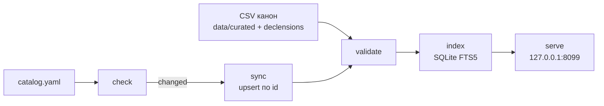
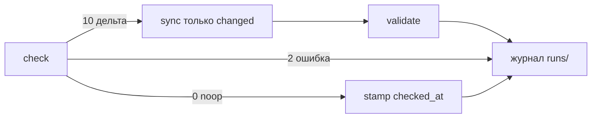

# Toponym — реестр российских топонимов

Локальный канон имён мест и ведомств: CSV в git, поиск у себя на машине, без портала и без дампа ГАР.

[](LICENSE)
[](https://github.com/unhexx/toponym/releases/tag/2026.09.15)
[](https://github.com/unhexx/toponym/actions/workflows/ci.yml)
[](https://github.com/unhexx/toponym/releases)
[](pyproject.toml)
[](compose.yaml)
[](https://github.com/unhexx/toponym/pkgs/container/toponym)
[](docs/README.md)

**Evgeniy Chistyakov** aka **Unhandled Exception** · [DAO EXCEPTION EXPERT](https://exception.expert) · `unhandled@exception.expert`

Релиз: [`2026.09.15`](https://github.com/unhexx/toponym/releases/tag/2026.09.15). Лицензия репозитория: [MIT](LICENSE). Иходники — [`docs/SOURCES.md`](docs/SOURCES.md).

---

## Зачем

Имена рек, городов, улиц и служб нужны приложениям как **данные**, а не как чужой API. Здесь канон — UTF-8 CSV в git (Frictionless Tabular Data Package). Индекс SQLite FTS5 собирается локально и в git не кладётся. HTTP-поиск слушает только loopback `127.0.0.1:8099`: соседняя машина в LAN его не увидит.

Нет публичного портала, нет вендора `RU.zip` / полного ГАР, нет SDK. Любое приложение читает CSV как есть.

## Как устроено

Канон лежит в `data/`. Скрипты проверяют источники, патчат строки по стабильному `id`, валидируют пакет и поднимают поиск на этой же машине.



Ежедневный прогон (`python scripts/daily.py`):



Подробности поиска — [`docs/USAGE.md`](docs/USAGE.md); прогона — [`docs/DAILY_UPDATE.md`](docs/DAILY_UPDATE.md).

## Пятиминутный старт (хост)

CPython 3.12+:

```bash
git clone https://github.com/unhexx/toponym.git
cd toponym
python3 -m venv .venv
source .venv/bin/activate
pip install -e ".[dev]"
python scripts/validate.py
python scripts/check.py --json
python scripts/index.py
python scripts/serve.py
```

После `pip install` те же команды на PATH: `toponym-validate`, `toponym-check`, `toponym-index`, `toponym-serve`. `python scripts/*.py` не ломается.

Альтернатива: `uv venv .venv && source .venv/bin/activate && uv pip install -e ".[dev]"`.

Ожидаемо: `validate.py` печатает `ok` и выходит 0. `check.py --json` ходит в сеть (коды 0 / 10 / 2). `index.py` пишет `knowledge/registry.db` (gitignored). `serve.py` слушает `127.0.0.1:8099`.

Проверка:

- http://127.0.0.1:8099/healthz
- http://127.0.0.1:8099/v1/search?q=Волга

## One-shot (Docker Compose)

Если на хосте нет CPython 3.12 — тот же канон поднимается ящиком.

Первый запуск (сборка из Dockerfile):

```bash
git clone https://github.com/unhexx/toponym.git
cd toponym
docker compose up --build
```

Обновление без компиляции (пин `ghcr.io/unhexx/toponym:2026.09.15`):

```bash
docker compose pull && docker compose up
```

Обновление из исходников клонированного репозитория:

```bash
git pull && docker compose up --build
```

Слушает только loopback: http://127.0.0.1:8099/healthz  
Поиск: http://127.0.0.1:8099/v1/search?q=Волга  

Compose публикует только `127.0.0.1:8099`.

На хосте без Docker: `python3 -m venv .venv && source .venv/bin/activate && pip install -e ".[dev]"`, затем `toponym-validate && toponym-index && toponym-serve` (или `python scripts/validate.py && python scripts/index.py && python scripts/serve.py`; bind `127.0.0.1:8099`).

## Что в реестре

См. [`data/curated/types.csv`](data/curated/types.csv) и [`docs/taxonomy.md`](docs/taxonomy.md).

Основные классы: хоронимы · ойконимы · гидронимы · оронимы · годонимы · урбанонимы · инсулонимы · ведомства.

Верхний уровень типов — `toponym` / `oikonym` / `hydronym` (не «Торопум»; DEC-TAX-001).

Канон: **CSV UTF-8, LF, заголовок обязателен**. Идентификаторы стабильны. Строки не удаляют — `status=deprecated` + `replaced_by`. Крупные дампы (ГАР/ФИАС, GeoNames `RU.zip`) **не вендорятся**.

```
data/
  curated/          # канонические таблицы
  declensions/      # падежи: nom gen dat acc ins pre loc2
  raw/              # указатели + SOURCE.md (не смешивать с curated)
  sources/          # каталог и журналы прогонов
schema/             # JSON Schema колонок
scripts/            # check, sync, validate, index, serve, daily, …
ontology/           # overlay DEC-*
docs/               # оглавление: docs/README.md
```

## Документация

Полный указатель: [`docs/README.md`](docs/README.md).

| Документ | О чём |
|---|---|
| [docs/USAGE.md](docs/USAGE.md) | поиск и склонения (HTTP и офлайн CSV) |
| [docs/DAILY_UPDATE.md](docs/DAILY_UPDATE.md) | ежедневный прогон куратора |
| [docs/SOURCES.md](docs/SOURCES.md) | лицензии источников и границы вендора |
| [docs/DECLENSIONS.md](docs/DECLENSIONS.md) | падежи, gold / queue |
| [docs/taxonomy.md](docs/taxonomy.md) | типы топонимов |
| [Дизайн v1](docs/design/2026-09-09-v1-local-registries.md) | снимок выпущенного v1 |
| [Compose-ящик](docs/design/2026-09-11-loop2-compose-box.md) | loopback-поиск в контейнере |
| [Презентация 2026.09.11](docs/presentation/toponym-2026.09.11.md) | продуктовая колода |
| [CONTRIBUTING.md](CONTRIBUTING.md) | вклад в канон |
| [CHANGELOG.md](CHANGELOG.md) | история релизов (CalVer `YYYY.MM.DD`) |
| [CITATION.cff](CITATION.cff) | как цитировать |
| [TASK_SPECIFICATION.md](TASK_SPECIFICATION.md) | спецификация |
| [CYCLE_PLAN.md](CYCLE_PLAN.md) | план циклов (завершён) |
| [ADR](LOCAL_REGISTRIES_DESIGN_AND_ROADMAP.md) | исторический снимок решений |
| [datapackage.json](datapackage.json) · [schema/](schema/) | машинный канон |
| [catalog.yaml](data/sources/catalog.yaml) | источники и детекторы |
| [Релиз 2026.09.15](https://github.com/unhexx/toponym/releases/tag/2026.09.15) | тег и GitHub Release |

## Источники

Сводка: [`docs/SOURCES.md`](docs/SOURCES.md). Каталог с детекторами: [`data/sources/catalog.yaml`](data/sources/catalog.yaml).

| Источник | Что даёт | Лицензия | В каноне |
|---|---|---|---|
| Wikidata | Q-id, имена, P625 | CC0 | сиды мест |
| Указ № 326 / № 522 | структура ФОИВ | официальный текст | `agencies-foiv.csv` |
| ISO 3166-2:RU | коды субъектов | ISO | `regions.csv` |
| GeoNames | идентификаторы, mods | CC BY 4.0 | id, не `RU.zip` |
| ГКГН | официальные названия | открытые данные | указатель |
| ФИАС / ГАР | адресная иерархия | открытые данные | указатель, без дампа |
| hflabs/region, hflabs/city | регионы и города + ФИАС | CC BY-SA 4.0 | только `data/raw/` |

## Склонения

Золотые таблицы в `data/declensions/`. Правила — [`docs/DECLENSIONS.md`](docs/DECLENSIONS.md).

Поля: `id,type_code,lemma,yo,gender,paradigm,declinable,nom,gen,dat,acc,ins,pre,loc2,review,source`.

`review`: `gold` (не перезаписывать), `needs_review` (авто без ручной проверки), `auto`.

Очередь автоформ (не канон): [`data/declensions/queue.csv`](data/declensions/queue.csv). CLI: `python scripts/declensions_queue.py --id wd:Q… --lemma …` (только очередь, `review=needs_review`; `--review gold` — отказ). pymorphy/Natasha не пишут `gold` (DEC-DECL-001).

Уникальность склонений — `(id, lemma)` (DEC-DECL-002); `id` в файле может повторяться.

## Скрипты

```bash
python scripts/check.py --json          # детекторы; 0 / 10 / 2
python scripts/sync.py --source ID      # dry-run; --apply пишет
python scripts/validate.py              # frictionless + инварианты
python scripts/index.py                 # knowledge/registry.db FTS5
python scripts/serve.py                 # loopback JSON, 127.0.0.1:8099
python scripts/daily.py                 # check → sync-changed → validate → журнал
python scripts/fetch_dump.py --source geonames-ru   # RU.zip в tmp, не в git
python scripts/declensions_queue.py --id wd:Q… --lemma …   # только queue.csv
```

Console scripts (после `pip install -e .`): `toponym-check`, `toponym-validate`, `toponym-index`, `toponym-serve`.

Поиск по индексу: `MATCH 'Волга'` (гидроним), `MATCH 'МВД'` (`foiv:mvd`).

HTTP (только GET, только loopback): `/healthz`, `/v1/search?q=…`, `/v1/records?id=…`, `/v1/declensions?id=…`.

## Автоматизация

- GitHub Actions: [`.github/workflows/ci.yml`](.github/workflows/ci.yml) — pytest, ruff, validate, compose-smoke, GHCR.
- Daily: `python scripts/daily.py` (GHA [`.github/workflows/daily.yml`](.github/workflows/daily.yml) — install + run + commit-if-diff).
- Куратор: [`docs/DAILY_UPDATE.md`](docs/DAILY_UPDATE.md) — без пустого коммита.

## Цитирование

См. [`CITATION.cff`](CITATION.cff). Версия: `2026.09.15`.

---

Обратная связь: `unhandled@exception.expert`.
