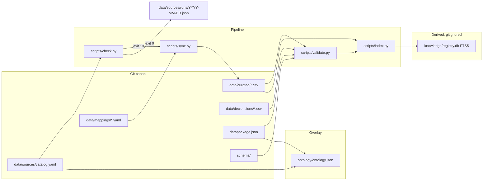
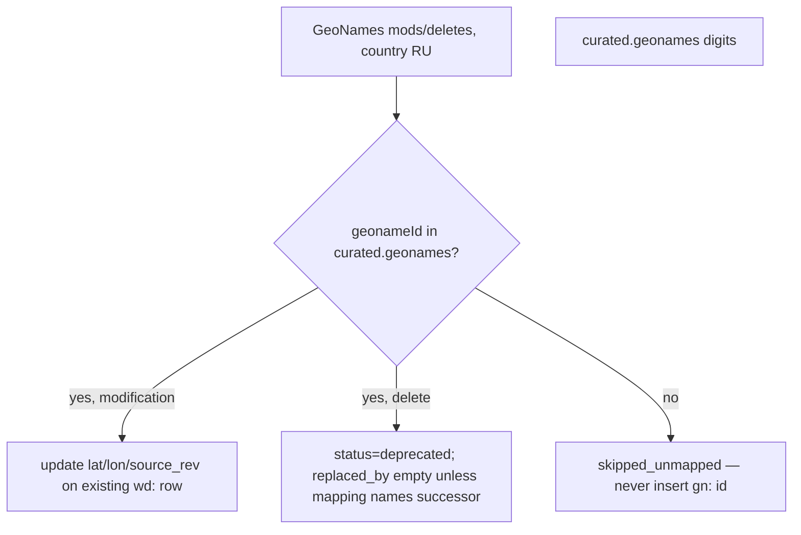

# Toponym v1 Local Registries — Implementation Design

| Field | Value |
|---|---|
| **Document** | Implementation design and full-cycle plan for `unhexx/toponym` v1 |
| **Author** | Engineering (product repo) |
| **Date** | 2026-09-09 |
| **Revised** | 2026-09-09 (review 2: align to landed P0–P5 `3c16dbf`; `(id, lemma)` declensions; `http_dated` RU-rows only) |
| **Status** | Active |
| **CalVer target** | `2026.09.09` |
| **ADR** | [`LOCAL_REGISTRIES_DESIGN_AND_ROADMAP.md`](../../LOCAL_REGISTRIES_DESIGN_AND_ROADMAP.md) (DEC-REG-001) |
| **Spec** | [`TASK_SPECIFICATION.md`](../../TASK_SPECIFICATION.md) |
| **Operational plan** | [`CYCLE_PLAN.md`](../../CYCLE_PLAN.md) (repo root; execute from here) |

This is not a greenfield vision. DEC-REG-001 already chose Frictionless CSV in git, derived SQLite FTS, and an Outpost ontology overlay. This document freezes interfaces, seed policy, CLI, tests, and one independently mergeable PR per INVEST cycle P0–P9 so an engineer can implement without guessing.

**SSOT for this design:** this file under `docs/design/`. Do not keep a parallel copy with `file://` ADR links.

Operator overrides of the ADR (binding):

1. Agentix consumer-starter **full** is already installed (sibling symlink, not a vendored tree).
2. All development cycles are planned; the executable plan lives at repo root as `CYCLE_PLAN.md`.
3. After each completed INVEST cycle: merge to `main` and `git push origin main` (overrides ADR §9.1 “do not merge until operator accepts Reviewer DONE”).
4. Commits in natural Russian, as a human mid/senior developer. Never mention models, agents, LLM, Grok, Claude, or AI.
5. Continue until a full v1 release (tag `2026.09.09` / GitHub Release). Empty commits forbidden.
6. Keep **ten** cycles P0–P9. Do **not** split P1 into P1a–e.

---

## Overview

`unhexx/toponym` on `main` @ `3c16dbf` has P0–P5 landed: schemas, 11 datapackage CSVs, mappings, `check.py` / `sync.py` / `validate.py`, CI, `missingValues: [""]` on places/agencies. Remaining v1 work is P6 FTS, P7 ontology, P8 docs, P9 tag.

Canon stays UTF-8 CSV in git. Dumps larger than 10 MB and full ГАР/ФИАС are never vendored. CC BY-SA and ODbL stay in `data/raw/<source>/`. Curated rows are typed from official names, ISO 3166-2, Wikidata (CC0), and GeoNames **identifiers** — not copied wholesale from ShareAlike repos.

**Next cycle is P6-INDEX.** Do not reopen P0–P5 except the documented `http_dated` Last-Modified bugfix (ride with P6 or a one-line follow-up: `also: last_modified_header` must not flip `changed`).

---

## Background & Motivation

### Current state (verified 2026-09-09, after P5 merge `3c16dbf`)

| Claim | Reality |
|---|---|
| P0–P5 | **Landed on `main`.** P0 `2330f94`, P1 `4b321c7`, P2 `ab462b8`, P3 `94e76ac`, P4 `a275f42`, P5 `3c16dbf`. `CYCLE_PLAN.md` marks P0–P5 COMPLETE, P6 PENDING. |
| `datapackage.json` 11 resources | **All CSV paths exist.** `python scripts/validate.py` exit 0. |
| Curated seeds | 8 FO, 89 subjects (83 ISO + 6 `local:*`), **197** cities-major (all `parent_id=iso:RU-XX`), ≥40 hydronyms, ≥25 oronyms, ≥69 FOIV, ≥10 other (`source_id=wikidata`). oikonym `example_ru=Москва`. |
| Declensions | Landed uniqueness is **`(id, lemma)`**. `data/declensions/agencies.csv` has 158 rows / 79 duplicate ids (abbr `indecl` + full-name `agency-head`). `tests/test_seeds.py` asserts `(id, lemma)`. |
| `geonames` column | **Empty on every curated row**, including `wd:Q649`. P4 fixtures carry `524901`; live match-only sync is a no-op (`skipped_unmapped`). |
| `schema/` | Present. P5 added `primaryKey: id` and `missingValues: [""]` on places/agencies. |
| Scripts | `check.py`, `sync.py`, `validate.py` present. **No** `index.py` yet. |
| `.github/workflows/` | `ci.yml` (P5, Python 3.12) and `daily.yml` present. |
| `docs/SOURCES.md` | **Missing.** |
| `docs/TAXONOMY.md` (README) | File on disk is `docs/taxonomy.md` (Linux is case-sensitive). |
| Catalog detectors | All 10 sources. `geonames-ru` `kind: http_dated`, `cursor: "2026-09-08"`, `also: last_modified_header`. Landed `detect_http_dated` still ORs dump Last-Modified against that date cursor (daily false `changed`) — **v1 freeze below ignores `also` for `changed`**. |
| Agentix full | Present. `.venv` CPython 3.14.7, symlink gitignored. |
| Git | `main` @ `3c16dbf`. Origin `https://github.com/unhexx/toponym.git`. |
| `agents/DAILY_UPDATE.md` | Already rewritten (step 1 = `check.py`). P8 must not rewrite it from the old sketch. |

### Pain (remaining after P5)

- No FTS index (`scripts/index.py` / `knowledge/registry.db`) — P6.
- No `ontology/ontology.json` — P7.
- Review language still disagrees: AGENTS.md / README `review=true`; CONTRIBUTING `review=false` for gold. P8 aligns to `gold\|auto\|needs_review`.
- Empty curated `geonames` cells: daily GeoNames `--apply` cannot update coords until an optional P6/P8 backfill.
- Landed `http_dated` dump Last-Modified vs date `cursor` can force daily exit 10. V1 freeze: `changed` is **only** RU rows in mods/deletes.

### Why this shape (DEC-REG-001, unchanged)

CSV + Table Schema is the interchange any app can read (Python, Go, Excel, DuckDB). Git gives review and CalVer. SQLite FTS is derived, gitignored, rebuilt by `scripts/index.py`. Ontology is an overlay, not a second canon.

---

## Goals & Non-Goals

### Goals (v1 Definition of Done)

- All 11 `datapackage.json` resources exist, UTF-8 LF comma-CSV, ≥1 data row each.
- Canonical columns frozen (places/agencies) and Table Schema published under `schema/`.
- `python scripts/check.py --json` works **without secrets**; exit `0` (no change) / `10` (changes) / `2` (error).
- `python scripts/sync.py` upserts by stable `id` and deprecates; never deletes rows; GeoNames **never inserts** unknown `gn:` ids.
- `python scripts/validate.py` exit `0` on the tree; a broken fixture fails.
- `python scripts/index.py` builds `knowledge/registry.db` FTS5; queries `Волга` and `МВД` hit.
- `ontology/ontology.json` is valid JSON, contains `DEC-REG-001` and one Source per catalog id.
- Daily path: either apply a delta, or write `data/sources/runs/YYYY-MM-DD.json` (and typically bump `checked_at`) — never an empty commit.
- Reviewer gate: tests green, no vendored file >10 MB under `data/`, top-level type remains `toponym` (not «Торопум» as a type name).
- GitHub Release + tag `2026.09.09`.

### Non-goals (v1)

- Full import of GeoNames `RU.zip` or ГАР/ФИАС.
- Inserting unmapped GeoNames ids as `gn:{geonameId}` curated rows.
- Autogenerated pymorphy/Natasha rows as gold declensions.
- Rewriting landed gold declensions to force unique `id` (P1 uniqueness is `(id, lemma)`).
- Rewriting the top-level taxonomy (`toponym` / oikonym / hydronym / …).
- Public HTTP API / `scripts/serve.py`.
- A second ontology format besides Outpost `ontology/ontology.json`.
- Vendoring the Agentix template tree (symlink SSOT only).
- Copying hflabs CC-BY-SA tables into `data/curated/`.
- Population time-series, polygons, GeoJSON, PostGIS.
- Municipalities, streets (hodonyms), microtoponyms as populated tables (types exist; seed tables do not).
- Splitting P1 into sub-cycles P1a–e.

---

## Proposed Design

### Target tree (v1)

```
toponym/
├── AGENTS.md
├── TASK_SPECIFICATION.md
├── CYCLE_PLAN.md
├── pyproject.toml                 # exists (P0)
├── datapackage.json               # schema refs exist (P0)
├── CHANGELOG.md
├── schema/                        # exists (P0); P5 adds missingValues
├── data/
│   ├── curated/
│   │   ├── types.csv              # exists; patch oikonym
│   │   ├── federal-districts.csv
│   │   ├── regions.csv
│   │   ├── cities-major.csv
│   │   ├── hydronyms-major.csv
│   │   ├── oronyms-major.csv
│   │   ├── agencies-foiv.csv
│   │   └── agencies-other.csv
│   ├── declensions/
│   │   ├── regions.csv
│   │   ├── cities-major.csv
│   │   ├── agencies.csv
│   │   └── queue.csv              # optional; not a datapackage resource in v1
│   ├── mappings/
│   │   ├── geonames.yaml
│   │   ├── gkgn.yaml
│   │   ├── fias-pointer.yaml
│   │   ├── hflabs-region.yaml
│   │   └── ukase-326.yaml
│   ├── raw/
│   │   ├── README.md
│   │   ├── hflabs-region/SOURCE.md
│   │   ├── hflabs-city/SOURCE.md
│   │   ├── geonames-ru/SOURCE.md
│   │   ├── fias-gar/SOURCE.md
│   │   └── wikidata/cities-major.sparql
│   └── sources/
│       ├── catalog.yaml           # SSOT (no root duplicate)
│       └── runs/YYYY-MM-DD.json
├── scripts/
│   ├── __init__.py                # exists (P0)
│   ├── check.py
│   ├── sync.py
│   ├── validate.py
│   ├── index.py
│   └── lib/
│       ├── __init__.py
│       ├── csvio.py
│       ├── catalog.py
│       ├── detectors.py
│       └── upsert.py
├── knowledge/                     # gitignored derived
│   ├── registry.db
│   └── LAST_INDEX
├── ontology/
│   ├── ontology.json
│   └── ontology.schema.json
├── tests/
│   ├── conftest.py
│   ├── test_schema.py             # exists (P0)
│   ├── test_seeds.py
│   ├── test_check.py
│   ├── test_upsert.py
│   ├── test_validate.py
│   ├── test_index.py
│   ├── test_ontology.py
│   ├── test_no_vendor.py          # created in P4
│   └── fixtures/
├── docs/
│   ├── DECLENSIONS.md
│   ├── taxonomy.md
│   ├── SOURCES.md                 # NEW (P8)
│   └── design/2026-09-09-v1-local-registries.md
├── agents/DAILY_UPDATE.md
└── .github/workflows/ci.yml       # pytest + validate (P5)
```

`catalog.yaml` stays at `data/sources/catalog.yaml`. Do **not** add a second `catalog.yaml` at repo root (ADR tree listed both; current repo already chose `data/sources/`).

### Architecture



### Daily update sequence

Matches live `agents/DAILY_UPDATE.md` (already rewritten; P8 does not replace this diagram with the old step numbering).

```mermaid
sequenceDiagram
  participant D as Daily operator
  participant C as check.py
  participant S as sync.py
  participant V as validate.py
  participant I as index.py
  participant G as git
  D->>C: python scripts/check.py --json
  alt changed_count = 0
    C-->>D: exit 0
    D->>G: write runs/YYYY-MM-DD.json; bump checked_at if needed
    D->>G: commit chore(data): daily refresh (0 records) OR no commit if already written today
  else changed_count > 0
    C-->>D: exit 10
    D->>S: python scripts/sync.py --source ID --apply
    S->>V: python scripts/validate.py
    V->>I: python scripts/index.py
    D->>G: commit chore(data): daily refresh YYYY-MM-DD (N records, sources: …)
  else detector error
    C-->>D: exit 2 (no commit)
  end
```

Until P3, missing `check.py` is treated as `changed_count=0` (DAILY_UPDATE §1). Do not invent a CSV delta.

### Frozen canonical record (places + agencies)

Single profile. Unused fields stay empty string. Header order is **normative** (tests assert exact header):

```
id,id_scheme,type_id,name_ru,name_yo,name_en,abbr,parent_id,admin1,lat,lon,wd,geonames,fias,oktmo,iso,status,replaced_by,source_id,source_rev,updated_at,notes
```

| Column | Type | Required | Rules |
|---|---|---|---|
| `id` | string PK | yes | `{scheme}:{value}`: `wd:Q649`, `iso:RU-MOS`, `foiv:mvd`, `fo:cfo`, `gkgn:{n}`, `fias:{guid}`, `local:{slug}`. **v1 seeds never use `gn:` as `id`.** |
| `id_scheme` | string | yes | enum: `wikidata` \| `geonames` \| `iso3166-2` \| `fias` \| `gkgn` \| `foiv` \| `fo` \| `local` |
| `type_id` | string FK | yes | must exist in `data/curated/types.csv` `id` |
| `name_ru` | string | yes | NFC; `ё`→`е` **only here**; no surrounding whitespace |
| `name_yo` | string | no | original spelling with `ё` when it exists; else copy of `name_ru` or empty |
| `name_en` | string | no | English endonym/exonym |
| `abbr` | string | no | ЦФО, МВД, RU-MOS. May contain `ё` (e.g. Росмолодёжь). |
| `parent_id` | string | no | must exist in the **union** of curated place/agency ids when non-empty (soft FK; validated in P5). See parent_id table below. |
| `admin1` | string | no | ISO 3166-2 code **without** `iso:` prefix (`RU-MOS`) for objects inside a subject |
| `lat` `lon` | number or empty | no | WGS84; both empty or both set; lat ∈ [-90,90], lon ∈ [-180,180]. Empty string is allowed; P5 schema must declare `missingValues: [""]` so Frictionless `type: number` accepts it. |
| `wd` | string | no | `Q` + digits, no prefix |
| `geonames` | string | no | digits only (the GeoNames id). This is the **v1 join key** for `geonames-ru` sync. |
| `fias` | string | no | UUID |
| `oktmo` | string | no | 8 or 11 digits |
| `iso` | string | no | `RU-XX` or `RU-XXX` as in ISO 3166-2:RU **only**. Never copy GOST 7.67 Latin codes here. |
| `status` | enum | yes | `active` \| `deprecated` |
| `replaced_by` | string | **optional** | set when a successor id is known. **Not** required when `status=deprecated`. GeoNames deletes rarely name a replacement. |
| `source_id` | string FK | yes | `catalog.yaml` `sources[].id` (no `manual` source in v1) |
| `source_rev` | string | no | ISO date or source SHA |
| `updated_at` | date | yes | `YYYY-MM-DD` |
| `notes` | string | no | free text; may mention historical typos |

**Canonical `parent_id` (P1 freeze):**

| Table | `parent_id` |
|---|---|
| federal-districts | empty |
| regions | `fo:cfo` … `fo:dfo` |
| cities-major | **`iso:RU-XX`** — the subject row id (never empty in v1; never `fo:*`; never a bare `RU-XX`) |
| hydronyms-major, oronyms-major | empty (objects span subjects) |
| agencies-foiv | supervising ministry `foiv:{slug}` when the ukase nests the body; empty under the President or Government directly |
| agencies-other | empty |

**Id assignment priority (P1 freeze):**

| Table | Primary `id` | `id_scheme` |
|---|---|---|
| federal-districts | `fo:cfo` … `fo:dfo` | `fo` |
| regions with ISO 3166-2:RU | `iso:RU-MOS` | `iso3166-2` |
| regions without ISO 3166-2:RU (6) | `local:ru-crimea` etc. | `local` |
| cities-major, hydronyms, oronyms | `wd:Q…` | `wikidata` |
| agencies-foiv / agencies-other | `foiv:mvd` | `foiv` |

Never change a published `id`. To replace a row: insert the new id, set old `status=deprecated`, set `replaced_by=<new id>` **if** the successor is known.

### Types table (already exists; different schema)

`data/curated/types.csv` is **not** the canonical place record. Frozen header:

```
id,level,parent_id,name_ru,name_en,name_en_alt,example_ru,geonames_class,notes
```

**P1 patched** the `oikonym` row (stable id, not a full rewrite). Was:

```
oikonym,primary,toponym,ойконим,oikonym,settlement name|село|деревня,P,населённый пункт
```

Correct:

```
oikonym,primary,toponym,ойконим,oikonym,settlement name,Москва,P,населённый пункт; EN also place-name
```

«Торопум» invariant: forbidden as `id`, `name_ru`, or `name_en` of any types/places/agencies row. The notes cell of `toponym` may keep the phrase “на слайде опечатка «Торопум»” as documentation of the slide typo. Validators scan `id`/`name_ru`/`name_en` only.

### Declensions (gold) — unique `(id, lemma)` per file (landed P1)

Header frozen from `docs/DECLENSIONS.md` (SSOT; other docs are wrong until P8):

```
id,type_code,lemma,yo,gender,paradigm,declinable,nom,gen,dat,acc,ins,pre,loc2,review,source
```

| Field | Enum / rule |
|---|---|
| `id` | same stable id as the place/agency row. **Not unique** in a declension file. Uniqueness is **`(id, lemma)`** (`tests/test_seeds.py` `test_unique_ids_per_curated_file`). |
| `type_code` | `types.csv` id (`subject`, `city`, `agency`, `potamonym`, …) |
| `gender` | `m` \| `f` \| `n` \| `pl` |
| `paradigm` | `noun_m2` \| `noun_f1` \| `noun_f3` \| `noun_n_ovo` \| `adj_m` \| `mixed_phrase` \| `pl_tantum` \| `indecl` \| `agency-head` |
| `declinable` | `always` \| `never` \| `optional` \| `not_with_generic` |
| `review` | **`gold` \| `auto` \| `needs_review`** — not a boolean |
| `source` | catalog id or `manual` (`manual` is allowed **only** on this column, not as `source_id` on places/agencies) |

**Agency identity (landed P1, binding):** two rows with the same `id` are allowed when lemmas differ. Do **not** emit `foiv:mvd#head`. Do **not** rewrite the 79 duplicate-id gold pairs.

- **Abbr row:** `id=foiv:mvd`, `lemma=МВД`, `paradigm=indecl`, `declinable=never`, `review=gold`.
- **Full-name row:** `id=foiv:mvd`, `lemma=Министерство внутренних дел`, `paradigm=agency-head`, `declinable=always`, `review=gold`.
- Landed `agencies.csv`: 158 rows, 79 ids with both lemmas. Росгвардия is `noun_f1` + `agency-head`.
- FTS `MATCH 'МВД'` hits `agencies-foiv.csv` `abbr` (and the indecl lemma if indexed later).
- Hydronyms: one lemma row is enough; Дон fills `loc2`. A second lemma is allowed only if `(id, lemma)` stays unique.

Landed `validate.py` currently keys declensions as `(id, paradigm)`, which passes because abbr vs full name use different paradigms. **Contract for P6+:** uniqueness is `(id, lemma)` as in `test_seeds.py`. Align validate to that key if they ever diverge. Do not fail CI by asserting unique `id` on declension files.

`sync.py` **must not write** a row whose existing `review=gold`. New auto rows go to `data/declensions/queue.csv` (not a datapackage resource in v1) or into the table with `review=needs_review`.

CONTRIBUTING.md currently says `review=false` for gold — inverted; P8 sets `review=gold`. AGENTS.md / README `review=true` maps to `needs_review` (P8 edits AGENTS.md Непреложно §6 and NEVER).

### Package and runtime

`pyproject.toml` already exists from P0 (do not recreate). Contents:

```toml
[build-system]
requires = ["setuptools>=68", "wheel"]
build-backend = "setuptools.build_meta"

[project]
name = "toponym"
version = "2026.09.09"
description = "Local registry of Russian toponyms and agencies"
readme = "README.md"
requires-python = ">=3.12"
license = { text = "MIT" }
dependencies = [
  "frictionless>=5.18,<6",
  "jsonschema>=4.18,<5",
  "pyyaml>=6.0,<7",
  "requests>=2.32,<3",
]

[project.optional-dependencies]
dev = ["pytest>=8.0,<9", "ruff>=0.6,<1"]

[tool.setuptools.packages.find]
include = ["scripts*"]

[tool.ruff]
target-version = "py312"
line-length = 100
src = ["scripts", "tests"]

[tool.ruff.lint]
select = ["E", "F", "I", "UP", "W"]

[tool.pytest.ini_options]
testpaths = ["tests"]
addopts = "-q"
```

Install: `uv pip install -e ".[dev]"` inside the existing `.venv` (AGENTS.md). Do not create a second venv. Do not vendor Agentix.

**Import freeze:** `from scripts.lib.catalog import …` / `from scripts.lib.detectors import …`. CLI stays `python scripts/check.py` (no `python -m scripts.check` rename in v1). Every CLI module bootstraps the repo root so the command works **without** relying on the script directory being on `sys.path`:

```python
from __future__ import annotations

import sys
from pathlib import Path

_ROOT = Path(__file__).resolve().parents[1]
if str(_ROOT) not in sys.path:
    sys.path.insert(0, str(_ROOT))

from scripts.lib.catalog import load_catalog  # noqa: E402
```

Editable install (`include = ["scripts*"]`) then also works. Do not use `from lib.detectors import …`.

### CSV I/O (`scripts/lib/csvio.py`)

- Open with `encoding="utf-8-sig"` on read (strip BOM if present) and write `encoding="utf-8"` **without BOM**.
- `newline=""` + `lineterminator="\n"` + `delimiter=","` + `quoting=csv.QUOTE_MINIMAL`.
- Reject CR (`\r`) on validate.
- Never rewrite a file if the byte payload is unchanged (empty-commit guard).
- Upsert is load → dict-by-id → merge → write **stable row order** (existing order, new ids appended, no sort-by-name that churns the whole file).

### Detectors and `check.py`

Catalog detector kinds (closed enum, matches `schema/catalog.schema.json`):

| `kind` | Behaviour |
|---|---|
| `http_head` | `HEAD` (fallback `GET`); compare `ETag` / `Last-Modified` / `Content-Length` to `cursor` |
| `http_dated` | Expand `{yesterday}` as UTC `YYYY-MM-DD` in each URL; `HEAD`/`GET` the **small** dated files (never `RU.zip`). Download body. **v1 `changed` iff at least one country=`RU` row in mods or deletes.** HTTP 200 + non-empty **non-RU** body → `changed=false` (reason `"0 RU rows in mods"`). Empty/404 dated file → `changed=false`. **`also: last_modified_header` is informational and does not flip `changed`.** |
| `github_commits` | `GET https://api.github.com/repos/{repo}/commits?since={checked_at}&per_page=1`. Unauthenticated is enough (60 req/h). Use `GITHUB_TOKEN` if set. `changed` if newest SHA ≠ `cursor`. Live catalog has **five** such sources: `hflabs-region`, `hflabs-city`, `epogrebnyak-ru-cities`, `mfursov-russian-cities`, `nickyx3-settlements`. |
| `page_fingerprint` | `GET` HTML; strip scripts/styles; collapse whitespace; SHA-256 hex; compare to `cursor` |
| `none` | Never reports `changed` automatically. Human gate (official PDF of the ukase) |

Timeouts: 15 s per URL. User-Agent: `toponym-check/2026.09.09 (+https://github.com/unhexx/toponym)`. No retries beyond one. Network errors → that source `error=true`, process exit `2` if any error.

`geonames-ru` live catalog: `cursor` is the mods date token `"2026-09-08"`, `also: last_modified_header`. That date string is **not** an RFC 1123 Last-Modified / ETag. Comparing RU.zip `Last-Modified` (`Wed, 09 Sep 2026 …`) to `cursor` would make `changed=true` every day.

**v1 freeze:** for `kind: http_dated`, `changed` is **only** RU rows in the small mods/deletes files. `also: last_modified_header` does **not** set `changed`. Do not GET/download `RU.zip`. Do not store dump LM in the date `cursor`. `http_head` sources may keep LM/ETag in `cursor`; `http_dated` must not.

Landed P3 `detect_http_dated` still ORs dump LM into `changed` (and writes `cursor_new = dump_lm`). **Patch on P6 (or a one-line follow-up):** ignore `also` when deciding `changed`; keep `cursor` as the mods date. Do not add a `dump_url` key (`catalog.schema.json` has none).

CLI:

```
python scripts/check.py [--json] [--source ID] [--offline]
```

- `--offline`: do not hit the network; compare nothing; exit `2` unless every selected source is `kind: none` (then exit `0`). Used by unit tests with fixtures, not by daily.
- Tests inject a `requests` Session / monkeypatch.

Stdout JSON shape (normative):

```json
{
  "as_of": "2026-09-09T10:00:00Z",
  "sources": [
    {
      "id": "geonames-ru",
      "changed": false,
      "reason": "0 RU rows in mods",
      "cursor_old": "2026-09-08",
      "cursor_new": "2026-09-08",
      "error": false
    }
  ],
  "changed_count": 0,
  "error_count": 0
}
```

Exit codes: `0` no change and no errors; `10` `changed_count > 0` and `error_count = 0`; `2` `error_count > 0` (even if some sources changed).

P3 **must** include a fixture: non-empty mods body with **no** `RU` country rows → exit `0`, that source `changed=false`.

### `sync.py`

```
python scripts/sync.py [--source ID | --all] [--apply] [--dry-run] [--manual-file PATH]
```

Default is **dry-run** (print intended upsert/deprecate counts, write nothing). `--apply` writes. `--dry-run` is explicit alias of default.

`--manual-file PATH` is required for `ukase-326` to ingest rows. The file **must** use the canonical 22-column header (same as places/agencies). Id assignment for new FOIV rows remains `foiv:{slug}` chosen by the operator in that CSV; sync does not invent slugs from HTML.

Rules:

1. Read mapping `data/mappings/<id>.yaml` and catalog row.
2. If `vendor: true` and remote `Content-Length` > `max_vendor_bytes` (default 10485760) → refuse, exit `2`.
3. If `vendor: false` → do not download the dump. For GeoNames, fetch only `modifications-{date}.txt` and `deletes-{date}.txt` (small). For pointer sources, update `checked_at`/`cursor` only.
4. **Generic upsert** (manual-file / library): match on canonical `id`; incoming delete → `status=deprecated`; do not drop the row; set `replaced_by` only if the incoming record supplies a successor.
5. **GeoNames backend (v1, frozen):** parse TSV mods/deletes, country `RU` only. Match `geonameId` (digits) to curated **`geonames` column**. On match: update `lat`/`lon`/`source_rev`/`updated_at` (and `notes=coords from geonames-ru` if coords change) on the **existing** `wd:` (or other) row. On a deletes-file hit for a mapped id: `status=deprecated`; `replaced_by` stays empty unless a successor is in the mapping. **Refuse insert** of unknown `gn:` ids (count them as `skipped_unmapped`; do not create `id=gn:{id}`). v1 never publishes a new curated place from GeoNames. **Landed P1 left every `geonames` cell empty**, including `wd:Q649`. Until an optional P6/P8 backfill, live `--apply` is `skipped_unmapped` plus cursor/`checked_at` only. P4 unit tests use `tests/fixtures/places_wd_moscow.csv` (`geonames=524901`), **not** live `cities-major.csv`.
6. Skip writes into `data/declensions/*` when the existing row has `review=gold`.
7. Set `source_id`, `source_rev`, `updated_at=today` only for backends that own the row. GeoNames coord updates do **not** overwrite `source_id=wikidata` on a Wikidata-seeded city (put the GeoNames attribution in `notes`).
8. After apply: do not call validate internally (caller does); but refuse to write a row missing required columns.



v1 `sync.py` **implemented backends** (must have tests):

| Source | Backend |
|---|---|
| `geonames-ru` | Parse mods/deletes (country `RU` only); **match `geonames` column; never insert unknown `gn:` ids** |
| `ukase-326` | No automatic HTML scrape into curated. `--apply` only refreshes `checked_at` unless `--manual-file PATH` is passed. Catalog `url` is the **Wikipedia fingerprint** page (`page_fingerprint` signal only), **not** the legal text. Put `pravo.gov.ru` in `title`/`notes`. Do not treat the Wikipedia URL as a source of official names. |
| `hflabs-region`, `hflabs-city` | Pointer: refresh cursor/SHA only. **Never copy rows into curated**. Mapping `delete_policy: pointer` (there is **no** `pointer:` bool in `mapping.schema.json`). |
| `fias-gar`, `gkgn-opendata` | Pointer: refresh `checked_at` only. `fias-pointer.yaml` uses `delete_policy: pointer`. |
| others | `checked_at` bump only |

Unit-test fixtures:

- Generic upsert: 2-row CSV + 1 new incoming **canonical** id → 3 rows; incoming delete of id A → A still present with `status=deprecated`; `replaced_by` set **only if provided**.
- GeoNames **fixture** (`places_wd_moscow.csv`, not live CSV): `wd:Q649` with `geonames=524901` + incoming mods row gn:524901 → **still one row** (`wd:Q649`), coords updated, **no** `gn:524901` row. Incoming unknown geonameId → row count unchanged.
- Gold declension row unchanged when incoming tries to overwrite.

### `validate.py`

```
python scripts/validate.py [--datapackage PATH] [--json]
```

Exit `0` ok, `1` one or more errors, `2` crash / missing file.

Checks, in order:

1. `frictionless validate datapackage.json` (schema + encoding). P5 **landed** `missingValues: [""]` and `primaryKey: id` on places/agencies so empty lat/lon pass.
2. Every resource path exists and has a header + ≥1 data row.
3. Unique `id` per **places/agencies** file and unique `id` across the union of places+agencies. Declension files: unique **`(id, lemma)`** (landed `test_seeds.py`). Declension `id` **may** repeat (abbr vs full name). Do not assert unique `id` on `data/declensions/*`.
4. `type_id` ∈ `types.csv`.
5. `source_id` ∈ catalog (except `types.csv`, which has no `source_id`). There is no catalog id `manual`.
6. `status` ∈ {`active`,`deprecated`}. `replaced_by` is **not** required when deprecated.
7. `id`/`name_ru`/`name_en` do not equal or equal-ignore-case `торопум` / `Торопум`.
8. File is UTF-8, no CR, comma delimiter.
9. `name_ru` contains no `ё`/`Ё`.
10. `parent_id` empty or exists in the union of curated ids (types parent_id is types-internal).
11. No file under **`data/`** (not only `raw/` + `curated/`) exceeds 10 MB. Matches P9 `find data -type f -size +10M`.
12. `iso` unique among regions where non-empty.
13. Federal districts count = 8; regions count = 89.

### `index.py`

```
python scripts/index.py [--out knowledge/registry.db]
```

Creates parent dir. Rebuilds from scratch (not incremental in v1). Gitignore already has `knowledge/*.db` and `knowledge/LAST_INDEX`.

`records.id` is `TEXT PRIMARY KEY` and still has SQLite’s implicit `rowid` (do **not** use `WITHOUT ROWID`). FTS5 external-content requires that `rowid` plus the three triggers below.

```sql
CREATE TABLE records (
  id TEXT PRIMARY KEY,
  table_name TEXT NOT NULL,
  type_id TEXT,
  name_ru TEXT,
  name_yo TEXT,
  name_en TEXT,
  abbr TEXT,
  parent_id TEXT,
  admin1 TEXT,
  wd TEXT,
  geonames TEXT,
  iso TEXT,
  status TEXT,
  source_id TEXT
);
CREATE VIRTUAL TABLE records_fts USING fts5(
  name_ru, name_yo, name_en, abbr, wd,
  content='records', content_rowid='rowid',
  tokenize='unicode61'
);
CREATE TRIGGER records_ai AFTER INSERT ON records BEGIN
  INSERT INTO records_fts(rowid, name_ru, name_yo, name_en, abbr, wd)
  VALUES (new.rowid, new.name_ru, new.name_yo, new.name_en, new.abbr, new.wd);
END;
CREATE TRIGGER records_ad AFTER DELETE ON records BEGIN
  INSERT INTO records_fts(records_fts, rowid, name_ru, name_yo, name_en, abbr, wd)
  VALUES ('delete', old.rowid, old.name_ru, old.name_yo, old.name_en, old.abbr, old.wd);
END;
CREATE TRIGGER records_au AFTER UPDATE ON records BEGIN
  INSERT INTO records_fts(records_fts, rowid, name_ru, name_yo, name_en, abbr, wd)
  VALUES ('delete', old.rowid, old.name_ru, old.name_yo, old.name_en, old.abbr, old.wd);
  INSERT INTO records_fts(rowid, name_ru, name_yo, name_en, abbr, wd)
  VALUES (new.rowid, new.name_ru, new.name_yo, new.name_en, new.abbr, new.wd);
END;
CREATE TABLE sync_meta (
  source_id TEXT PRIMARY KEY,
  checked_at TEXT,
  cursor TEXT,
  hash TEXT
);
```

Rebuild-from-scratch: `DROP` / recreate, then `INSERT INTO records` (triggers keep FTS in sync). Load every curated places/agencies CSV. `sync_meta` from catalog.

Acceptance query (pytest):

```sql
SELECT r.id FROM records_fts f
JOIN records r ON r.rowid = f.rowid
WHERE records_fts MATCH 'Волга';
-- ≥1 row, hydronym Волга

SELECT r.id FROM records_fts f
JOIN records r ON r.rowid = f.rowid
WHERE records_fts MATCH 'МВД';
-- foiv:mvd  (hits agencies.abbr)
```

`LAST_INDEX` is one line: ISO timestamp + row count.

### Outpost ontology (`ontology/ontology.json`)

ADR: “формат Outpost”, entities Project / Artifact / Decision / Source / Mapping / Check / Risk / Lesson / Registry. There is no second schema in-tree; freeze this JSON (P7 also adds `ontology/ontology.schema.json`).

```json
{
  "schema": "outpost-ontology/v1",
  "project": {
    "id": "PRJ-TOPONYM",
    "name": "toponym",
    "calver": "2026.09.09",
    "canon": "frictionless-tabular-data-package"
  },
  "entities": [
    {
      "id": "DEC-REG-001",
      "type": "Decision",
      "title": "Canon = git + Frictionless Tabular Data Package",
      "status": "accepted",
      "date": "2026-09-09",
      "refs": ["LOCAL_REGISTRIES_DESIGN_AND_ROADMAP.md"]
    }
  ]
}
```

Required entity types and ids:

| Type | Ids |
|---|---|
| Project | `PRJ-TOPONYM` |
| Artifact | `ART-CATALOG`, `ART-DATAPACKAGE`, `ART-SCHEMA` |
| Decision | `DEC-REG-001` |
| Registry | `REG-PLACES`, `REG-AGENCIES`, `REG-DECLENSIONS`, `REG-TYPES` |
| Source | `SRC-{catalog.id}` uppercased with hyphens, e.g. `SRC-GEONAMES-RU`, one per catalog source |
| Mapping | `MAP-GN-CANON`, `MAP-GKGN`, `MAP-FIAS-POINTER`, `MAP-HFLABS-REGION`, `MAP-UKASE-326` |
| Check | `CHK-DETECTOR` (class of check.py; instance checks live in runs/, not in ontology). P7 tests must **not** expect a dated `CHK-2026-09-09`. |
| Risk | `RSK-FIAS-VENDOR`, `RSK-CCBYSA-CURATED`, `RSK-EMPTY-COMMIT` |
| Lesson | `LSN-SEEDS-MISSING` — daily no-op was caused by CHANGELOG claiming seeds that were not in git |

P7 tests: JSON parses; schema validates; `DEC-REG-001` present; `len(Source) == len(catalog.sources)`.

---

## API / Interface Changes

There is no HTTP API in v1. The interface is files + four CLIs.

### `datapackage.json` (P0, already landed)

Keep existing resource names/paths. P0 already added `schema` + `dialect` on every resource. Do not re-patch in P1 except if a resource path is wrong (it is not).

`places.schema.json` is shared by federal-districts, regions, cities-major, hydronyms-major, oronyms-major. `agencies.schema.json` shared by agencies-foiv and agencies-other. `declensions.schema.json` shared by the three declension resources.

P0 tests validate JSON Schema of `schema/*.json` and catalog.yaml against `catalog.schema.json`, not the full package. P5 **landed**: `validate.py` exit 0 on the real package.

### Catalog YAML (P0, already landed — do not invent keys)

Live `geonames-ru` entry (normative; `schema/catalog.schema.json` `additionalProperties: false`):

```yaml
  - id: geonames-ru
    url: https://download.geonames.org/export/dump/RU.zip
    license: CC-BY-4.0
    vendor: false
    max_vendor_bytes: 10485760
    checked_at: 2026-09-09
    cursor: "2026-09-08"
    detector:
      kind: http_dated
      urls:
        - https://download.geonames.org/export/dump/modifications-{yesterday}.txt
        - https://download.geonames.org/export/dump/deletes-{yesterday}.txt
      also: last_modified_header
```

Detector object allows **only**: `kind`, `urls`, `repo`, `since`, `also`, `note`. There is **no** `dump_url` and **no** `stale_after_days`. Dump URL = `source.url`.

Required keys per source: `id`, `license`, `vendor`, `detector`, `checked_at`. Optional: `url`, `title`, `max_vendor_bytes`, `cursor`, `last_updated`, `notes` is **not** on the source object in the landed schema — use `detector.note` or `title`. (If P3 needs a human `notes` field, that is a schema change with tests; v1 default is `detector.note`.)

`ukase-326.url` is Wikipedia `Структура_федеральных_органов_исполнительной_власти_России_(с_2024)` — fingerprint only. Legal text is Указ № 326 / № 522 on pravo.gov.ru; record that in `title` (already: “Указ Президента № 326…”) and `detector.note`.

Watchlist stays as `watchlist_github: [owner/repo, …]` and is **not** auto-fetched in v1 beyond the five `github_commits` sources.

### Mapping YAML (P2)

Landed `schema/mapping.schema.json` required properties: `source_id`, `stable_id`, `fields`, `delete_policy`. `delete_policy` enum: **`deprecate` | `ignore` | `pointer`**. Optional: `class_map`, `filter`, `notes`. **No `pointer` boolean.** P2 must **not** emit `pointer: true`.

- `geonames.yaml`: `delete_policy: deprecate`. `stable_id` documents the join: curated `geonames` column ← GeoNames `geonameId`. Does not mint `gn:` ids.
- `fias-pointer.yaml` and `hflabs-region.yaml`: `delete_policy: pointer`. Notes state CC-BY-SA / do-not-vendor.

---

## Data Model Changes

### Places Table Schema (Frictionless)

Landed `schema/table/places.schema.json` (P5) has the 22 fields, `lat`/`lon` `type: number`, `primaryKey: id`, `missingValues: [""]`, `status` / `id_scheme` enums, `required` on `id`, `id_scheme`, `type_id`, `name_ru`, `status`, `source_id`, `updated_at`.

P5 added to both `places.schema.json` and `agencies.schema.json`:

```json
{
  "primaryKey": "id",
  "missingValues": [""],
  "fields": ["…unchanged…"]
}
```

Empty `lat`/`lon` on P1 seeds pass Frictionless because of `missingValues`. v1 recommendation: leave coords empty unless Wikidata P625 is looked up.

Agencies table schema is the same fields (agencies simply leave geo empty). Keeping two files lets us tighten `type_id` pattern later without a format break.

### Seed policy and actual v1 rows

**License rule for every seed row:** type the name from an official or CC0/CC-BY (not SA) source; store identifiers (ISO, Wikidata Q, GeoNames id, FIAS GUID if known from official docs). Do **not** paste hflabs CSV. Do **not** copy Wikipedia “список городов >100k” prose into curated (CC BY-SA). `source_id` on official-name rows is `wikidata` or `ukase-326` or `gkgn-opendata` (names), never `hflabs-region`, never `manual`.

Attribution for GeoNames-derived coordinates (if used later by sync): keep `source_id=wikidata` on Wikidata-seeded rows; `notes=coords from geonames-ru`. **v1 seeds: leave lat/lon empty** unless the implementer looks up Wikidata P625 (CC0). Prefer P625.

#### 1. Federal districts — 8 rows (`data/curated/federal-districts.csv`)

`type_id=federal-district`. `parent_id` empty. `source_id=wikidata`. Abbr as used by the Bank of Russia / common official short forms. `wd` filled (verified 2026-09-09 via ruwiki sitelinks).

| id | abbr | name_ru | name_en | wd | notes (admin centre) |
|---|---|---|---|---|---|
| `fo:cfo` | ЦФО | Центральный федеральный округ | Central Federal District | Q190778 | Москва |
| `fo:szfo` | СЗФО | Северо-Западный федеральный округ | Northwestern Federal District | Q383093 | Санкт-Петербург |
| `fo:ufo` | ЮФО | Южный федеральный округ | Southern Federal District | Q483599 | Ростов-на-Дону |
| `fo:skfo` | СКФО | Северо-Кавказский федеральный округ | North Caucasian Federal District | Q485161 | Пятигорск |
| `fo:pfo` | ПФО | Приволжский федеральный округ | Volga Federal District | Q202317 | Нижний Новгород |
| `fo:urfo` | УрФО | Уральский федеральный округ | Ural Federal District | Q41964 | Екатеринбург |
| `fo:sfo` | СФО | Сибирский федеральный округ | Siberian Federal District | Q41979 | Новосибирск |
| `fo:dfo` | ДФО | Дальневосточный федеральный округ | Far Eastern Federal District | Q41968 | Владивосток |

Public sources: Указ Президента РФ от 13.05.2000 № 849 (as amended); Wikidata CC0.

#### 2. Subjects — 89 rows (`data/curated/regions.csv`)

`type_id=subject`. `parent_id` = federal district id. `iso` filled for the 83 codes in ISO 3166-2:RU. `admin1` = the ISO code when present (`RU-MOS`, not `iso:RU-MOS`).

**Coverage policy (explicit):** the registry follows the list of subjects in Article 65 of the Constitution of the Russian Federation (89). ISO 3166-2:RU currently assigns codes to 83 of them. The other six have **no** ISO 3166-2:RU code; ISO 3166-2:UA assigns codes internationally. v1 stores those six with `id_scheme=local`, **empty `iso`**, and a factual `notes` cell citing ISO-UA and that GOST 7.67-2024 lists additional Latin codes. **Those GOST codes are not ISO 3166-2:RU and must not be copied into `iso`.** (ISO `RU-KR` is Karelia / `iso:RU-KR`. A GOST `RU-KR` for Crimea would collide.) Verify GOST citations against the standard text at P1; if the standard is not at hand, keep the notes sentence generic (“GOST 7.67-2024 additional Latin codes, not ISO 3166-2:RU”) rather than inventing codes.

**Cities-major does not seed settlements in those six subjects.** Regions table still has 89 choronym rows.

`name_ru` = official constitutional name (not the truncated Wikidata label). `name_yo` empty unless `ё` appears in the official form.

**Federal district membership** — counts that must sum to 89:

| FO | ISO subjects | local | n |
|---|---|---|---|
| `fo:cfo` | BEL BRY VLA VOR IVA KLU KOS KRS LIP MOS ORL RYA SMO TAM TVE TUL YAR MOW | — | 18 |
| `fo:szfo` | KR KO ARK VLG KGD LEN MUR NGR PSK SPE NEN | — | 11 |
| `fo:ufo` | **AD KL KDA AST VGG ROS (6 ISO)** | six `local:*` | **12** |
| `fo:skfo` | DA IN KB KC SE STA CE | — | 7 |
| `fo:pfo` | BA ME MO TA UD CU PER KIR NIZ ORE PNZ SAM SAR ULY | — | 14 |
| `fo:urfo` | KGN SVE TYU CHE KHM YAN | — | 6 |
| `fo:sfo` | AL TY KK ALT KYA IRK KEM NVS OMS TOM | — | 10 |
| `fo:dfo` | BU SA ZAB KAM PRI KHA AMU MAG SAK YEV CHU | — | 11 |

18+11+12+7+14+6+10+11 = **89**. ЮФО is **6 ISO + 6 local**, not “8 ISO + 6”.

Frozen 89-row appendix (id, name_ru, name_en, abbr, parent_id, iso, wd). `wd` for the 83 is Wikidata P300 (verified 2026-09-09). `source_id=wikidata`.

**Republics (21):**

| id | name_ru | name_en | abbr | parent_id | iso | wd |
|---|---|---|---|---|---|---|
| `iso:RU-AD` | Республика Адыгея | Republic of Adygea | Адыгея | `fo:ufo` | RU-AD | Q3734 |
| `iso:RU-AL` | Республика Алтай | Altai Republic | Алтай | `fo:sfo` | RU-AL | Q5971 |
| `iso:RU-BA` | Республика Башкортостан | Republic of Bashkortostan | Башкортостан | `fo:pfo` | RU-BA | Q5710 |
| `iso:RU-BU` | Республика Бурятия | Republic of Buryatia | Бурятия | `fo:dfo` | RU-BU | Q6809 |
| `iso:RU-DA` | Республика Дагестан | Republic of Dagestan | Дагестан | `fo:skfo` | RU-DA | Q5118 |
| `iso:RU-IN` | Республика Ингушетия | Republic of Ingushetia | Ингушетия | `fo:skfo` | RU-IN | Q5219 |
| `iso:RU-KB` | Кабардино-Балкарская Республика | Kabardino-Balkarian Republic | КБР | `fo:skfo` | RU-KB | Q5267 |
| `iso:RU-KL` | Республика Калмыкия | Republic of Kalmykia | Калмыкия | `fo:ufo` | RU-KL | Q3953 |
| `iso:RU-KC` | Карачаево-Черкесская Республика | Karachay-Cherkess Republic | КЧР | `fo:skfo` | RU-KC | Q5328 |
| `iso:RU-KR` | Республика Карелия | Republic of Karelia | Карелия | `fo:szfo` | RU-KR | Q1914 |
| `iso:RU-KO` | Республика Коми | Komi Republic | Коми | `fo:szfo` | RU-KO | Q2073 |
| `iso:RU-ME` | Республика Марий Эл | Mari El Republic | Марий Эл | `fo:pfo` | RU-ME | Q5446 |
| `iso:RU-MO` | Республика Мордовия | Republic of Mordovia | Мордовия | `fo:pfo` | RU-MO | Q5340 |
| `iso:RU-SA` | Республика Саха (Якутия) | Sakha (Yakutia) | Якутия | `fo:dfo` | RU-SA | Q6605 |
| `iso:RU-SE` | Республика Северная Осетия — Алания | North Ossetia–Alania | Северная Осетия | `fo:skfo` | RU-SE | Q5237 |
| `iso:RU-TA` | Республика Татарстан | Republic of Tatarstan | Татарстан | `fo:pfo` | RU-TA | Q5481 |
| `iso:RU-TY` | Республика Тыва | Tyva Republic | Тыва | `fo:sfo` | RU-TY | Q960 |
| `iso:RU-UD` | Удмуртская Республика | Udmurt Republic | Удмуртия | `fo:pfo` | RU-UD | Q5422 |
| `iso:RU-KK` | Республика Хакасия | Republic of Khakassia | Хакасия | `fo:sfo` | RU-KK | Q6543 |
| `iso:RU-CE` | Чеченская Республика | Chechen Republic | Чечня | `fo:skfo` | RU-CE | Q5187 |
| `iso:RU-CU` | Чувашская Республика | Chuvash Republic | Чувашия | `fo:pfo` | RU-CU | Q5466 |

**Krais (9):**

| id | name_ru | name_en | abbr | parent_id | iso | wd |
|---|---|---|---|---|---|---|
| `iso:RU-ALT` | Алтайский край | Altai Krai | Алтайский край | `fo:sfo` | RU-ALT | Q5942 |
| `iso:RU-ZAB` | Забайкальский край | Zabaykalsky Krai | Забайкальский край | `fo:dfo` | RU-ZAB | Q6838 |
| `iso:RU-KAM` | Камчатский край | Kamchatka Krai | Камчатский край | `fo:dfo` | RU-KAM | Q7948 |
| `iso:RU-KDA` | Краснодарский край | Krasnodar Krai | Краснодарский край | `fo:ufo` | RU-KDA | Q3680 |
| `iso:RU-KYA` | Красноярский край | Krasnoyarsk Krai | Красноярский край | `fo:sfo` | RU-KYA | Q6563 |
| `iso:RU-PER` | Пермский край | Perm Krai | Пермский край | `fo:pfo` | RU-PER | Q5400 |
| `iso:RU-PRI` | Приморский край | Primorsky Krai | Приморский край | `fo:dfo` | RU-PRI | Q4341 |
| `iso:RU-STA` | Ставропольский край | Stavropol Krai | Ставропольский край | `fo:skfo` | RU-STA | Q5207 |
| `iso:RU-KHA` | Хабаровский край | Khabarovsk Krai | Хабаровский край | `fo:dfo` | RU-KHA | Q7788 |

**Oblasts (46):** `name_ru` = «{stem}ская область» / official form below. `parent_id` from the membership table. `wd` from P300.

| id | name_ru | parent_id | iso | wd |
|---|---|---|---|---|
| `iso:RU-AMU` | Амурская область | `fo:dfo` | RU-AMU | Q6886 |
| `iso:RU-ARK` | Архангельская область | `fo:szfo` | RU-ARK | Q1875 |
| `iso:RU-AST` | Астраханская область | `fo:ufo` | RU-AST | Q3941 |
| `iso:RU-BEL` | Белгородская область | `fo:cfo` | RU-BEL | Q3329 |
| `iso:RU-BRY` | Брянская область | `fo:cfo` | RU-BRY | Q2810 |
| `iso:RU-VLA` | Владимирская область | `fo:cfo` | RU-VLA | Q2702 |
| `iso:RU-VGG` | Волгоградская область | `fo:ufo` | RU-VGG | Q3819 |
| `iso:RU-VLG` | Вологодская область | `fo:szfo` | RU-VLG | Q2015 |
| `iso:RU-VOR` | Воронежская область | `fo:cfo` | RU-VOR | Q3447 |
| `iso:RU-IVA` | Ивановская область | `fo:cfo` | RU-IVA | Q2654 |
| `iso:RU-IRK` | Иркутская область | `fo:sfo` | RU-IRK | Q6585 |
| `iso:RU-KGD` | Калининградская область | `fo:szfo` | RU-KGD | Q1749 |
| `iso:RU-KLU` | Калужская область | `fo:cfo` | RU-KLU | Q2842 |
| `iso:RU-KEM` | Кемеровская область | `fo:sfo` | RU-KEM | Q6076 |
| `iso:RU-KIR` | Кировская область | `fo:pfo` | RU-KIR | Q5387 |
| `iso:RU-KOS` | Костромская область | `fo:cfo` | RU-KOS | Q2596 |
| `iso:RU-KGN` | Курганская область | `fo:urfo` | RU-KGN | Q5741 |
| `iso:RU-KRS` | Курская область | `fo:cfo` | RU-KRS | Q3178 |
| `iso:RU-LEN` | Ленинградская область | `fo:szfo` | RU-LEN | Q2191 |
| `iso:RU-LIP` | Липецкая область | `fo:cfo` | RU-LIP | Q3510 |
| `iso:RU-MAG` | Магаданская область | `fo:dfo` | RU-MAG | Q7971 |
| `iso:RU-MOS` | Московская область | `fo:cfo` | RU-MOS | Q1697 |
| `iso:RU-MUR` | Мурманская область | `fo:szfo` | RU-MUR | Q1759 |
| `iso:RU-NIZ` | Нижегородская область | `fo:pfo` | RU-NIZ | Q2246 |
| `iso:RU-NGR` | Новгородская область | `fo:szfo` | RU-NGR | Q2240 |
| `iso:RU-NVS` | Новосибирская область | `fo:sfo` | RU-NVS | Q5851 |
| `iso:RU-OMS` | Омская область | `fo:sfo` | RU-OMS | Q5835 |
| `iso:RU-ORE` | Оренбургская область | `fo:pfo` | RU-ORE | Q5338 |
| `iso:RU-ORL` | Орловская область | `fo:cfo` | RU-ORL | Q3129 |
| `iso:RU-PNZ` | Пензенская область | `fo:pfo` | RU-PNZ | Q5545 |
| `iso:RU-PSK` | Псковская область | `fo:szfo` | RU-PSK | Q2218 |
| `iso:RU-ROS` | Ростовская область | `fo:ufo` | RU-ROS | Q3573 |
| `iso:RU-RYA` | Рязанская область | `fo:cfo` | RU-RYA | Q2753 |
| `iso:RU-SAK` | Сахалинская область | `fo:dfo` | RU-SAK | Q7797 |
| `iso:RU-SAM` | Самарская область | `fo:pfo` | RU-SAM | Q1727 |
| `iso:RU-SAR` | Саратовская область | `fo:pfo` | RU-SAR | Q5334 |
| `iso:RU-SMO` | Смоленская область | `fo:cfo` | RU-SMO | Q2347 |
| `iso:RU-SVE` | Свердловская область | `fo:urfo` | RU-SVE | Q5462 |
| `iso:RU-TAM` | Тамбовская область | `fo:cfo` | RU-TAM | Q3550 |
| `iso:RU-TVE` | Тверская область | `fo:cfo` | RU-TVE | Q2292 |
| `iso:RU-TOM` | Томская область | `fo:sfo` | RU-TOM | Q5884 |
| `iso:RU-TUL` | Тульская область | `fo:cfo` | RU-TUL | Q2792 |
| `iso:RU-TYU` | Тюменская область | `fo:urfo` | RU-TYU | Q5824 |
| `iso:RU-ULY` | Ульяновская область | `fo:pfo` | RU-ULY | Q5634 |
| `iso:RU-CHE` | Челябинская область | `fo:urfo` | RU-CHE | Q5714 |
| `iso:RU-YAR` | Ярославская область | `fo:cfo` | RU-YAR | Q2448 |

`name_en` for oblasts: “Amur Oblast”, “Arkhangelsk Oblast”, … conventional English. `abbr` may be the stem («Амурская») or the ISO code; freeze `abbr` as the ISO code (`RU-AMU`) when no conventional short form is needed.

**Federal cities (2), autonomous oblast (1), autonomous okrugs (4):**

| id | name_ru | name_en | abbr | parent_id | iso | wd |
|---|---|---|---|---|---|---|
| `iso:RU-MOW` | Москва | Moscow | Москва | `fo:cfo` | RU-MOW | Q649 |
| `iso:RU-SPE` | Санкт-Петербург | Saint Petersburg | Санкт-Петербург | `fo:szfo` | RU-SPE | Q656 |
| `iso:RU-YEV` | Еврейская автономная область | Jewish Autonomous Oblast | ЕАО | `fo:dfo` | RU-YEV | Q7730 |
| `iso:RU-NEN` | Ненецкий автономный округ | Nenets Autonomous Okrug | НАО | `fo:szfo` | RU-NEN | Q2164 |
| `iso:RU-KHM` | Ханты-Мансийский автономный округ — Югра | Khanty-Mansi Autonomous Okrug – Yugra | Югра | `fo:urfo` | RU-KHM | Q6320 |
| `iso:RU-CHU` | Чукотский автономный округ | Chukotka Autonomous Okrug | Чукотка | `fo:dfo` | RU-CHU | Q7984 |
| `iso:RU-YAN` | Ямало-Ненецкий автономный округ | Yamalo-Nenets Autonomous Okrug | ЯНАО | `fo:urfo` | RU-YAN | Q6407 |

**Six without ISO 3166-2:RU** (`id_scheme=local`, `iso` empty, `admin1` empty):

| id | name_ru | name_en | parent_id | notes |
|---|---|---|---|---|
| `local:ru-crimea` | Республика Крым | Republic of Crimea | `fo:ufo` | ISO 3166-2:RU none; ISO 3166-2:UA `UA-43`. GOST 7.67-2024 Latin codes are not ISO 3166-2:RU — do not copy into `iso` (would collide with `iso:RU-KR` Karelia). |
| `local:ru-sevastopol` | Севастополь | Sevastopol | `fo:ufo` | ISO 3166-2:UA `UA-40`. `iso` empty. |
| `local:ru-dnr` | Донецкая Народная Республика | Donetsk People's Republic | `fo:ufo` | ISO 3166-2:UA `UA-14`. `iso` empty. |
| `local:ru-lnr` | Луганская Народная Республика | Lugansk People's Republic | `fo:ufo` | ISO 3166-2:UA `UA-09`. `iso` empty. |
| `local:ru-zaporozhye` | Запорожская область | Zaporozhye Oblast | `fo:ufo` | ISO 3166-2:UA `UA-23`. `iso` empty. |
| `local:ru-kherson` | Херсонская область | Kherson Oblast | `fo:ufo` | ISO 3166-2:UA `UA-65`. `iso` empty. |

`wd` for these six: fill at P1 from Wikidata if unambiguous (Crimea Q1599, Sevastopol Q7525 are well-known); leave empty rather than guess DNR/LNR items.

Acceptance: `wc -l` = 90 (header+89); 83 non-empty unique `iso`; 6 empty `iso` with `id_scheme=local`.

#### 3. Cities-major — policy + frozen named set

**Policy (frozen):**

Include a city if **any** of:

1. Population ≥ 100 000 (Rosstat estimate, latest published 1 Jan 2024 or 2025) **and** `admin1` is one of the 83 ISO 3166-2:RU codes.
2. It is the administrative centre of one of those 83 subjects (even if <100k).
3. It is a DECLENSIONS.md fixture: Москва, Нижний Новгород, Сочи, Орёл, Пушкин (Санкт-Петербург), Жуковский, Домодедово.

**Exclude:** settlements whose subject would be one of the six `local:*` (Севастополь `wd:Q7525`, Симферополь `wd:Q19566`, Керчь `wd:Q157065`, Евпатория `wd:Q33345`, …). v1.

**Do not** copy `hflabs/city`, `epogrebnyak/ru-cities`, or Wikipedia city lists. Build rows as: official Russian name + Wikidata Q-id (CC0) + GeoNames id if looked up from Wikidata P1566 + ISO `admin1`. `source_id=wikidata`. `parent_id=iso:RU-XX`. `lat`/`lon` empty unless P625. `geonames` may stay empty (landed P1); optional P6/P8 backfill of verified digits.

**Normative membership is the landed P1 table** `data/curated/cities-major.csv` (**197** rows as of `4b321c7` / `3c16dbf`). Tests (`tests/test_seeds.py`): `>= 150` **and** the named fixtures below (Пермь `wd:Q915`, Сочи `wd:Q39420`, …). SPARQL is provenance only (`data/raw/wikidata/cities-major.sparql`). Wikipedia city lists stay forbidden.

Do **not** fail v1 because six ids from an unused harvest appendix were never seeded: `wd:Q133075` Видное, `wd:Q135394` Долгопрудный, `wd:Q159112` Михайловск, `wd:Q176325` Октябрьский, `wd:Q1978797` Мурино, `wd:Q76493` Дзержинск. Adding them later is optional. Landed extras beyond any earlier 173-id draft are in-scope.

Live `geonames` cells are empty (including Москва). Do not treat the fixture table as if `524901` were already on the curated row.

**Required fixtures** (landed; one id per row; Q-ids verified). `wd:Q268` is Poznań, not Пермь. `wd:Q7525` is Севастополь, not Сочи.

| id | name_ru | parent_id | admin1 | notes |
|---|---|---|---|---|
| `wd:Q649` | Москва | `iso:RU-MOW` | RU-MOW | also a subject; city row is the oikonym. Live `geonames` empty; P4 fixture uses `524901` |
| `wd:Q656` | Санкт-Петербург | `iso:RU-SPE` | RU-SPE | |
| `wd:Q883` | Новосибирск | `iso:RU-NVS` | RU-NVS | |
| `wd:Q887` | Екатеринбург | `iso:RU-SVE` | RU-SVE | |
| `wd:Q900` | Казань | `iso:RU-TA` | RU-TA | |
| `wd:Q891` | Нижний Новгород | `iso:RU-NIZ` | RU-NIZ | mixed_phrase declension |
| `wd:Q906` | Челябинск | `iso:RU-CHE` | RU-CHE | |
| `wd:Q894` | Самара | `iso:RU-SAM` | RU-SAM | |
| `wd:Q911` | Уфа | `iso:RU-BA` | RU-BA | |
| `wd:Q908` | Ростов-на-Дону | `iso:RU-ROS` | RU-ROS | |
| `wd:Q3646` | Краснодар | `iso:RU-KDA` | RU-KDA | |
| `wd:Q898` | Омск | `iso:RU-OMS` | RU-OMS | |
| `wd:Q919` | Красноярск | `iso:RU-KYA` | RU-KYA | |
| `wd:Q3426` | Воронеж | `iso:RU-VOR` | RU-VOR | |
| `wd:Q915` | Пермь | `iso:RU-PER` | RU-PER | **not** Q268 |
| `wd:Q914` | Волгоград | `iso:RU-VGG` | RU-VGG | |
| `wd:Q39420` | Сочи | `iso:RU-KDA` | RU-KDA | indecl; **not** Q7525 |
| `wd:Q3118` | Орёл | `iso:RU-ORL` | RU-ORL | `name_yo=Орёл`, `name_ru=Орел` |
| `wd:Q7947` | Пушкин | `iso:RU-SPE` | RU-SPE | творительный *Пушкином* |
| `wd:Q136435` | Жуковский | `iso:RU-MOS` | RU-MOS | adj_m |
| `wd:Q135410` | Домодедово | `iso:RU-MOS` | RU-MOS | noun_n_ovo, declinable=optional |

#### 4. Hydronyms-major — named list (`type_id` potamonym / limnonym / hydronym)

`source_id=wikidata`. `parent_id` empty. `lat`/`lon` empty unless P625. Q-ids: verify at P1 by label + `P17=Q159`; names below are binding.

**Rivers (`potamonym`):** Волга, Обь, Енисей, Лена, Амур, Иртыш, Дон, Кама, Ока, Ангара, Печора, Северная Двина, Кубань, Терек, Урал (река), Нева, Москва (река), Колыма, Индигирка, Яна, Зея, Томь, Белая (Агидель), Вятка, Алдан, Вилюй, Селенга, Шилка, Аргунь.

**Lakes / seas (`limnonym` or `hydronym`):** Байкал, Ладожское озеро, Онежское озеро, Таймыр, Ханка, Ильмень, Чудско-Псковское озеро, Телецкое озеро, Каспийское море, Чёрное море, Азовское море, Балтийское море, Белое море, Баренцево море, Карское море, Охотское море, Берингово море.

Acceptance: ≥40 rows; must include Волга, Байкал, Дон, Нева, Обь, Енисей, Лена, Амур. Дон has `loc2` in declensions (*на Дону*) — one declension row.

#### 5. Oronyms-major — named list

`parent_id` empty. `source_id=wikidata`.

**Ranges / peaks (`oronym`):** Эльбрус, Казбек, Белуха, Народная, Ключевская Сопка, Уральские горы, Большой Кавказ, Алтай, Западный Саян, Восточный Саян, Сихотэ-Алинь, Верхоянский хребет, хребет Черского, Становой хребет, Хибины, плато Путорана, Валдайская возвышенность, Среднерусская возвышенность.

**Insulonyms (`insulonym`, allowed in this table in v1):** Сахалин, Курильские острова, Новая Земля, Земля Франца-Иосифа, Командорские острова, полуостров Камчатка, полуостров Таймыр, полуостров Ямал, Кольский полуостров.

Acceptance: ≥25 rows; must include Эльбрус, Уральские горы, Сахалин. Байкал is **not** an oronym (it lives in hydronyms).

#### 6. FOIV — Указ № 326 (11.05.2024) as amended by № 522 (17.06.2024)

All of the following are **in v1** `data/curated/agencies-foiv.csv`. `type_id=agency`. `id=foiv:{slug}`. `parent_id` = supervising ministry’s id when the ukase nests the body; empty for bodies under the President or Government directly. Always the full `foiv:` prefix.

Official names from the ukase (pravo.gov.ru / ConsultantPlus ред. от 17.06.2024). Wikipedia is the catalog **fingerprint URL only**. `source_id=ukase-326`. `source_rev=2024-06-17`.

**I. Under the President**

| id | abbr | name_ru | parent_id |
|---|---|---|---|
| `foiv:mvd` | МВД | Министерство внутренних дел Российской Федерации | |
| `foiv:mchs` | МЧС | Министерство Российской Федерации по делам гражданской обороны, чрезвычайным ситуациям и ликвидации последствий стихийных бедствий | |
| `foiv:mid` | МИД | Министерство иностранных дел Российской Федерации | |
| `foiv:rs` | Россотрудничество | Федеральное агентство по делам СНГ, соотечественников, проживающих за рубежом, и по международному гуманитарному сотрудничеству | `foiv:mid` |
| `foiv:mod` | Минобороны | Министерство обороны Российской Федерации | |
| `foiv:fstec` | ФСТЭК | Федеральная служба по техническому и экспортному контролю | `foiv:mod` |
| `foiv:minjust` | Минюст | Министерство юстиции Российской Федерации | |
| `foiv:fsin` | ФСИН | Федеральная служба исполнения наказаний | `foiv:minjust` |
| `foiv:fssp` | ФССП | Федеральная служба судебных приставов | `foiv:minjust` |
| `foiv:gfs` | ГФС | Государственная фельдъегерская служба Российской Федерации | |
| `foiv:svr` | СВР | Служба внешней разведки Российской Федерации | |
| `foiv:fsb` | ФСБ | Федеральная служба безопасности Российской Федерации | |
| `foiv:rosgvardiya` | Росгвардия | Федеральная служба войск национальной гвардии Российской Федерации | |
| `foiv:fso` | ФСО | Федеральная служба охраны Российской Федерации | |
| `foiv:fsvts` | ФСВТС | Федеральная служба по военно-техническому сотрудничеству | |
| `foiv:rosfinmonitoring` | Росфинмониторинг | Федеральная служба по финансовому мониторингу | |
| `foiv:rosarhiv` | Росархив | Федеральное архивное агентство | |
| `foiv:fmba` | ФМБА | Федеральное медико-биологическое агентство | |
| `foiv:gusp` | ГУСП | Главное управление специальных программ Президента Российской Федерации | |
| `foiv:udp` | УДП | Управление делами Президента Российской Федерации | |

ФМБА is listed under the President by Указ № 522 (17.06.2024) — notes must say so.

**II. Ministries under the Government + subordinated services/agencies**

| id | abbr | name_ru | parent_id |
|---|---|---|---|
| `foiv:minzdrav` | Минздрав | Министерство здравоохранения Российской Федерации | |
| `foiv:roszdravnadzor` | Росздравнадзор | Федеральная служба по надзору в сфере здравоохранения | `foiv:minzdrav` |
| `foiv:minkultury` | Минкультуры | Министерство культуры Российской Федерации | |
| `foiv:minobrnauki` | Минобрнауки | Министерство науки и высшего образования Российской Федерации | |
| `foiv:minprirody` | Минприроды | Министерство природных ресурсов и экологии Российской Федерации | |
| `foiv:rosgidromet` | Росгидромет | Федеральная служба по гидрометеорологии и мониторингу окружающей среды | `foiv:minprirody` |
| `foiv:rpn` | Росприроднадзор | Федеральная служба по надзору в сфере природопользования | `foiv:minprirody` |
| `foiv:rosvodresursy` | Росводресурсы | Федеральное агентство водных ресурсов | `foiv:minprirody` |
| `foiv:rosleshoz` | Рослесхоз | Федеральное агентство лесного хозяйства | `foiv:minprirody` |
| `foiv:rosnedra` | Роснедра | Федеральное агентство по недропользованию | `foiv:minprirody` |
| `foiv:minpromtorg` | Минпромторг | Министерство промышленности и торговли Российской Федерации | |
| `foiv:rosstandart` | Росстандарт | Федеральное агентство по техническому регулированию и метрологии | `foiv:minpromtorg` |
| `foiv:minprosveshcheniya` | Минпросвещения | Министерство просвещения Российской Федерации | |
| `foiv:minvr` | Минвостокразвития | Министерство Российской Федерации по развитию Дальнего Востока и Арктики | |
| `foiv:mcx` | Минсельхоз | Министерство сельского хозяйства Российской Федерации | |
| `foiv:fsvps` | Россельхознадзор | Федеральная служба по ветеринарному и фитосанитарному надзору | `foiv:mcx` |
| `foiv:rosrybolovstvo` | Росрыболовство | Федеральное агентство по рыболовству | `foiv:mcx` |
| `foiv:minsport` | Минспорт | Министерство спорта Российской Федерации | |
| `foiv:minstroy` | Минстрой | Министерство строительства и жилищно-коммунального хозяйства Российской Федерации | |
| `foiv:mintrans` | Минтранс | Министерство транспорта Российской Федерации | |
| `foiv:rostransnadzor` | Ространснадзор | Федеральная служба по надзору в сфере транспорта | `foiv:mintrans` |
| `foiv:favt` | Росавиация | Федеральное агентство воздушного транспорта | `foiv:mintrans` |
| `foiv:rosavtodor` | Росавтодор | Федеральное дорожное агентство | `foiv:mintrans` |
| `foiv:roszeldor` | Росжелдор | Федеральное агентство железнодорожного транспорта | `foiv:mintrans` |
| `foiv:morflot` | Росморречфлот | Федеральное агентство морского и речного транспорта | `foiv:mintrans` |
| `foiv:mintrud` | Минтруд | Министерство труда и социальной защиты Российской Федерации | |
| `foiv:rostrud` | Роструд | Федеральная служба по труду и занятости | `foiv:mintrud` |
| `foiv:minfin` | Минфин | Министерство финансов Российской Федерации | |
| `foiv:fns` | ФНС | Федеральная налоговая служба | `foiv:minfin` |
| `foiv:probpalata` | Пробирная палата | Федеральная пробирная палата | `foiv:minfin` |
| `foiv:ralco` | Росалкогольтабакконтроль | Федеральная служба по контролю за алкогольным и табачным рынками | `foiv:minfin` |
| `foiv:fts` | ФТС | Федеральная таможенная служба | `foiv:minfin` |
| `foiv:roskazna` | Казначейство | Федеральное казначейство | `foiv:minfin` |
| `foiv:rosimushchestvo` | Росимущество | Федеральное агентство по управлению государственным имуществом | `foiv:minfin` |
| `foiv:minkomsvyaz` | Минцифры | Министерство цифрового развития, связи и массовых коммуникаций Российской Федерации | |
| `foiv:rkn` | Роскомнадзор | Федеральная служба по надзору в сфере связи, информационных технологий и массовых коммуникаций | `foiv:minkomsvyaz` |
| `foiv:economy` | Минэкономразвития | Министерство экономического развития Российской Федерации | |
| `foiv:rsacc` | Росаккредитация | Федеральная служба по аккредитации | `foiv:economy` |
| `foiv:rosstat` | Росстат | Федеральная служба государственной статистики | `foiv:economy` |
| `foiv:rospatent` | Роспатент | Федеральная служба по интеллектуальной собственности | `foiv:economy` |
| `foiv:minenergo` | Минэнерго | Министерство энергетики Российской Федерации | |

`foiv:minkomsvyaz` slug is frozen from the historical short name **Минкомсвязь**; `abbr=Минцифры` is the current conventional short name. Do not rename the id. Notes: “slug historical Минкомсвязь; current abbr Минцифры”.

**III. Services/agencies under the Government directly**

| id | abbr | name_ru | parent_id |
|---|---|---|---|
| `foiv:fas` | ФАС | Федеральная антимонопольная служба | |
| `foiv:rosreestr` | Росреестр | Федеральная служба государственной регистрации, кадастра и картографии | |
| `foiv:rospotrebnadzor` | Роспотребнадзор | Федеральная служба по надзору в сфере защиты прав потребителей и благополучия человека | |
| `foiv:obrnadzor` | Рособрнадзор | Федеральная служба по надзору в сфере образования и науки | |
| `foiv:gosnadzor` | Ростехнадзор | Федеральная служба по экологическому, технологическому и атомному надзору | |
| `foiv:rosrezerv` | Росрезерв | Федеральное агентство по государственным резервам | |
| `foiv:fadm` | Росмолодёжь | Федеральное агентство по делам молодежи | |
| `foiv:fadn` | ФАДН | Федеральное агентство по делам национальностей | |

`foiv:fadm` `name_ru` uses `е` in молодежи; `name_yo` / `abbr` keep `ё` (Росмолодёжь, молодёжи).

Acceptance: ≥69 FOIV rows; `foiv:mvd` and `foiv:fmba` present; ФМБА notes mention № 522.

#### 7. agencies-other (not in the ukase structure)

Bodies that applications still look up next to FOIV. **`source_id=wikidata` only** (no `manual` — that id is not in `catalog.yaml`, and check 5 would fail). ≥10 rows:

| id | abbr | name_ru | parent_id |
|---|---|---|---|
| `foiv:genproc` | Генпрокуратура | Генеральная прокуратура Российской Федерации | |
| `foiv:skr` | СК России | Следственный комитет Российской Федерации | |
| `foiv:cbr` | Банк России | Центральный банк Российской Федерации | |
| `foiv:ach` | Счётная палата | Счетная палата Российской Федерации | |
| `foiv:ksrf` | КС РФ | Конституционный Суд Российской Федерации | |
| `foiv:vsrf` | ВС РФ | Верховный Суд Российской Федерации | |
| `foiv:cik` | ЦИК России | Центральная избирательная комиссия Российской Федерации | |
| `foiv:ap` | АП | Администрация Президента Российской Федерации | |
| `foiv:govstaff` | Аппарат Правительства | Аппарат Правительства Российской Федерации | |
| `foiv:sovbez` | Совбез | Совет Безопасности Российской Федерации | |

`foiv:ach` `name_ru=Счетная палата Российской Федерации`, `name_yo=Счётная палата Российской Федерации`.

`license: unknown` on `epogrebnyak-ru-cities` and `nickyx3-settlements` is allowed by catalog schema (`minLength: 2`) but those sources stay pointers — never copy their rows.

#### 8. Gold declensions

**Must be `review=gold`:** every fixture in `docs/DECLENSIONS.md` §фикстуры (Москва; Нижний Новгород; Сочи; Орёл; Пушкин *Пушкином*; Жуковский; Домодедово; Дон *на Дону*; **МВД as two rows** — `lemma=МВД`/`indecl` **and** `lemma=Министерство внутренних дел`/`agency-head`); all 8 federal districts; all 89 subject lemmas; FOIV **abbr + full-name pairs** as landed. Росгвардия: `noun_f1` + `agency-head` (landed). Do not collapse to one row.

**May be `needs_review`:** remaining cities-major (non-fixture) and remaining agencies-other if not hand-checked.

Сочи, Тольятти, Улан-Удэ: `declinable=never`. Домодедово: `optional`.

`data/declensions/regions.csv` covers FO + subjects (type_code `federal-district` / `subject`). `cities-major.csv` covers cities. `agencies.csv` covers FOIV + other. Unique **`(id, lemma)`** per file.

### hflabs / CC-BY-SA

hflabs/region and hflabs/city are CC-BY-SA-4.0. ShareAlike is **not** compatible with putting their rows into an MIT `data/curated/` table.

v1 approach (frozen):

- `data/raw/hflabs-region/SOURCE.md` and `data/raw/hflabs-city/SOURCE.md` — URL, license, “do not vendor the CSV”, how to clone for local lookup.
- `data/mappings/hflabs-region.yaml` maps hflabs columns → canonical fields with `delete_policy: pointer` for a *future* operator-run transform that would have to emit a ShareAlike derived dataset **into `data/raw/`**, not curated.
- Curated subject rows are typed from Constitution + ISO + Wikidata, which is enough to join to hflabs locally via `iso` / `fias` without copying their `name` field.

If an implementer needs FIAS GUIDs: look them up from the official ФИАС download **out of tree**, or leave `fias` empty in v1. Empty `fias` is allowed.

### GeoNames

CC-BY-4.0. `vendor: false`. `data/raw/geonames-ru/SOURCE.md` explains RU.zip (~tens of MB, not stored) and daily mods. v1 sync **updates existing rows only** via the `geonames` column. **Do not** create `gn:` place ids in v1.

Landed P1 did **not** fill `geonames` (0 cells). Match-only `--apply` is therefore a production no-op until digits exist. **Do not rewrite P1.** Optional **P6 or P8 backfill** of well-known verified ids (not a cycle split):

| id | name_ru | geonames | verified 2026-09-09 |
|---|---|---|---|
| `wd:Q649` | Москва | `524901` | GeoNames feature Moscow (`sws.geonames.org/524901`) |
| `wd:Q626` | Волга | `472776` | GeoNames `H.STM` Volga, country RU. **Not** `2022226` (that id is Khrustal’naya Kaskada, a P.PPL) |

Further digits: Wikidata P1566, then confirm the GeoNames feature is the same object before writing the cell. P4 tests already use `places_wd_moscow.csv` with `524901`.

### Migration strategy

No existing place rows. First write is an insert, not a migration. `types.csv` is patched by id (`oikonym` only) plus any additional type rows **only if** a seed `type_id` is missing (it should not be: `federal-district`, `subject`, `city`, `potamonym`, `limnonym`, `oronym`, `insulonym`, `agency` already exist).

---

## Cycle-by-cycle implementation

Operator policy, every cycle: work on `feature/P{n}-{slug}` from latest `main` → tests green → merge to `main` → `git push origin main`. Commit messages in Russian, conventional prefix, no mention of models/agents. Empty commits forbidden.

**Single-loop remaining work:** P6 → P7 → P8 → P9.

**Two-worker exception (TASK_SPEC / CYCLE_PLAN):** only P2 ∥ P6 after P1 — P2 already merged, so P6 is next even with two workers. Sync point after P5 (passed).

P0–P5 are **DONE** on `main` (`3c16dbf`). Do not reopen those PRs.

### P0-BOOT — LANDED (`2330f94`)

Do not re-implement.

### P1-SEED — LANDED (`4b321c7`)

Do not re-implement. Do not rewrite gold declensions to unique `id`. Do not add the six unseeded harvest ids as a test gate.

Landed `tests/test_seeds.py`: ≥150 cities + named fixtures; unique `(id, lemma)` on declensions; Perm `wd:Q915`; oikonym example Москва.

**Why not P1a–e (still):** operator wants 10 cycles; P1 already merged as one slice.

### P2-MAP — LANDED (`ab462b8`)

Do not re-implement. `delete_policy: pointer` on FIAS/hflabs; GeoNames mapping is column-join.

### P3-CHECK — LANDED (`94e76ac`)

Do not re-implement detectors from scratch. **Follow-up (ride with P6):** `detect_http_dated` must not set `changed` from dump Last-Modified / `also: last_modified_header`. `changed` = RU rows in mods/deletes only. Keep `cursor` as the mods date string. Never GET `RU.zip`.

### P4-SYNC — LANDED (`a275f42`)

Do not re-implement. GeoNames match-only is proven on **fixtures** (`places_wd_moscow.csv` `geonames=524901`), not live CSVs. Do not treat empty live `geonames` as a P4 defect.

### P5-VAL — LANDED (`3c16dbf`)

Do not re-implement. `missingValues: [""]` + `primaryKey: id` are on places/agencies. `validate.py` exit 0 on the tree. Declension uniqueness in validate currently uses `(id, paradigm)`; contract is `(id, lemma)` — align only if they diverge; **do not** assert unique declension `id`.

### P6-INDEX — SQLite FTS5  (**next**)

**Depends on:** P1 seeds (for Волга / МВД). P5 is on `main`.

**Creates:** `scripts/index.py`, `tests/test_index.py`, `knowledge/.gitkeep` optional (dir created at runtime). Include the three FTS triggers verbatim.

**Optional in the same PR (not required for MATCH tests):**
1. Patch `detect_http_dated` so `also: last_modified_header` does not flip `changed`.
2. Backfill `geonames=524901` on `wd:Q649` and `geonames=472776` on `wd:Q626` (Волга) — verified GeoNames features; **not** `2022226`.

**Acceptance:** `python scripts/index.py` then pytest MATCH `Волга` and `МВД`; db path gitignored; file size of testdb well under 10 MB.

### P7-ONT — ontology overlay

**Depends on:** P0 catalog (source list). One-loop after P6.

**Creates:** `ontology/ontology.json`, `ontology/ontology.schema.json`, `tests/test_ontology.py`.

**Acceptance:** JSON valid; schema valid; `DEC-REG-001` type Decision; Source count = catalog sources count; Risk `RSK-FIAS-VENDOR` present; Check id is `CHK-DETECTOR` (class), not a dated instance.

### P8-DOCS — human 5-minute start + CalVer

**Depends on:** P3–P7 so commands in README actually work.

**Creates/changes:**

- `README.md` (5-min path: clone, `bash Agent-Init.sh`, `uv pip install -e ".[dev]"`, `python scripts/validate.py`, `python scripts/check.py --json`, `python scripts/index.py`); link `docs/taxonomy.md` not `TAXONOMY.md`.
- `docs/SOURCES.md`.
- `CHANGELOG.md` move Unreleased seeds claim into `[2026.09.09]` **after they exist**.
- **`AGENTS.md`:** Непреложно §6 and NEVER — replace `review=true` with `review=needs_review` (auto inflection must not land as `gold`).
- `CONTRIBUTING.md`: gold is `review=gold` (not `review=false`).
- `CYCLE_PLAN.md`: mark P0 DONE if not already.
- `agents/DAILY_UPDATE.md`: **diff against current**. Expected: **no rewrite** (already matches Key Decision 8). Edit only if it drifted.
- `docs/DECLENSIONS.md` only if a cross-link is wrong; mention `(id, lemma)` uniqueness if needed.
- `CITATION.cff` already `2026.09.09`.

**Acceptance:** README commands are copy-pasteable; grep README for `TAXONOMY.md` is empty; CHANGELOG has `## [2026.09.09]` and does not claim Unreleased seeds; AGENTS.md does not say `review=true`; DAILY_UPDATE still mentions `scripts/check.py` as step 1.

**Out of cycle:** GitHub Release (P9).

### P9-DONE — reviewer gate + release

**Depends on:** P0–P8 on `main`.

**Does:**

- Full `pytest -q` and `ruff check scripts tests` and `python scripts/validate.py`.
- `find data -type f -size +10M` empty.
- `git ls-files` contains no `RU.zip`, no GAR dump.
- Types top-level `toponym` intact.
- Annotated tag `2026.09.09`; `gh release create 2026.09.09 --title "2026.09.09" --notes-file CHANGELOG.md` (or equivalent).
- Push tag + release.

**PR / empty-commit rule:** if CHANGELOG compare-links actually change, one commit on `main` (feature branch optional). If **no file changes**, **do not** open `feature/P9-release` and **do not** empty-commit; tag HEAD of `main`.

**Acceptance:** tag on origin; CI green; handoff DONE.

**Out of cycle:** any new seed family (streets, municipalities).

---

## Alternatives Considered

### A. SQLite/DuckDB as canon (rejected in DEC-REG-001)

**Pros:** faster search, fewer files. **Cons:** poor git diffs, consumers need a driver, review of a one-cell name fix is painful. FTS remains **derived**.

### B. Vendor GeoNames RU.zip + hflabs CSVs into `data/raw/` and generate curated (rejected for v1)

**Pros:** complete coverage. **Cons:** RU.zip ≫ 10 MB; hflabs is CC-BY-SA (ShareAlike contaminates MIT curated if copied); daily clone is slow; ADR forbids it. Pointers + small seeds give a useful v1 without the legal/size hit.

### C. Delay seeds and ship scripts first (rejected)

The current daily no-op exists **because** seed CSVs were not in git (now they are). Scripts without Волга/МВД cannot pass P6. P6 is the next cycle.

### D. Boolean `review` column (rejected)

Docs already disagree (`true` / `false` / `gold`). A three-way enum (`gold|auto|needs_review`) matches `docs/DECLENSIONS.md` and the pipeline (sync must know what is sacred). P8 deletes the boolean wording in AGENTS.md / CONTRIBUTING.

### E. Feature branch until all of P0–P9 done (ADR §9.1) vs merge each cycle (operator)

ADR wanted one long feature branch. Operator explicit: merge+push each cycle. **Chosen:** short-lived `feature/P{n}-*` PRs, each independently reviewable, merged to `main`. Rollback is `git revert` of that merge.

### F. Split P1 into P1a–e (rejected)

Operator wants ten cycles. TASK_SPEC P1 is one INVEST slice. P1 already merged. Tests: ≥150 + named fixtures; membership = landed CSV.

### G. Unique declension `id` / `id#head` suffix (rejected vs landed P1)

P1 landed **two rows** per FOIV (abbr `indecl` + full-name `agency-head`) with uniqueness **`(id, lemma)`**. A later one-row freeze would fail CI on 79 duplicate ids. Do not rewrite gold tables. Do not add `foiv:mvd#head`.

### H. FTS5 without external content (not chosen)

External content + three triggers keeps MATCH joined to `records.rowid` as specified. Documented so P6 does not guess trigger SQL.

---

## Security & Privacy Considerations

| Threat | Severity | Mitigation |
|---|---|---|
| Accidental vendor of ГАР/RU.zip | **High** | `vendor: false`; `max_vendor_bytes`; `test_no_vendor.py` (P4); validate check 11 on all of `data/`; CI `find -size +10M`; `sync.py` downloads to a temp dir outside git or refuses |
| Secrets in git | **High** | No `.env` commit; `GITHUB_TOKEN` optional env for check.py, never written to runs JSON |
| SSRF via catalog URL | **Low** (local CLI) | Only HTTPS; no file://; no redirects to private IPs required in v1 (document; optional block in P3 if cheap) |
| CC-BY-SA copy into MIT curated | **High** | Mapping `delete_policy: pointer`; test that `data/curated/**` does not contain hflabs license headers / characteristic extra columns |
| Unbounded `gn:` inserts duplicating `wd:` cities | **High** | GeoNames match-only; P4 fixture Q649 / 524901 |
| Personal data | **N/A** | No people in v1 tables |
| Unauthenticated GitHub API rate limit | **Med** | 60 req/h; catalog has **five** `github_commits` sources; daily one run is 5 req; exit 2 on 403 |
| Page fingerprint noise (Wikipedia FOIV page) | **Med** | `kind: page_fingerprint` reports changed often; human gate before `sync --apply --manual-file` on ukase-326; never auto-scrape agencies |

Threat model is a **local data repo**, not a network service. No authn. No inbound ports.

---

## Observability

| Signal | Where |
|---|---|
| Detector report | stdout JSON of `check.py`; persisted `data/sources/runs/YYYY-MM-DD.json` |
| `checked_at` / `cursor` | `catalog.yaml` (git history is the audit log) |
| Sync counts | stdout of `sync.py`: `{inserted, updated, deprecated, skipped_gold, skipped_unmapped}` |
| Validate errors | stdout list; `--json` `{errors:[{code,path,message}]}` |
| Index | `knowledge/LAST_INDEX` (timestamp, n_records) |
| Metrics | none in v1 (no server). CI status on GitHub Actions is the health check |
| Alerting | none. Daily human/agent reads exit code 10 vs 0 vs 2 |

Logging: scripts log to stderr at INFO (one line per source). No Python `logging` config files.

---

## Rollout Plan

1. **P0–P5 on `main` (`3c16dbf`):** schemas, seeds, mappings, check/sync/validate, CI. Done.
2. **P6:** FTS index; optional `http_dated` `also` patch; optional `geonames` backfill on Q649/Q626.
3. **P7:** ontology.
4. **P8:** docs tell the truth; AGENTS.md review enum; DAILY_UPDATE left as-is if it still matches.
5. **P9:** tag `2026.09.09`, GitHub Release. No empty commit if nothing changed.

**Feature flags:** none. Detector `kind: none` is the “off” switch for a source.

**Rollback:** revert the cycle’s merge commit on `main`. Data rollback is the same: git history of CSVs. Derived `registry.db` is rebuilt. Do not force-push `main` after a cycle has been pushed (operator merge policy).

**Partial failure:** do not block P6 on empty `geonames` cells or the six never-seeded harvest city ids.

---

## Risks

| Risk | Sev | Mitigation |
|---|---|---|
| Empty curated `geonames` → daily GeoNames no-op | Med | Optional P6/P8 backfill of verified digits; P4 fixtures already prove the join |
| `http_dated` dump LM vs date cursor | High | v1: ignore `also` for `changed`; patch `detect_http_dated` on P6 |
| 89 vs 83 subject politics / ISO gap | Med | Document both code systems in `notes`; cities excluded from the six; no slogans in `notes`; GOST codes not copied into `iso` |
| Wikipedia FOIV fingerprint flips daily | Med | `ukase-326` sync is `--manual-file`; check.py may exit 10; daily commit is runs+cursor only |
| Frictionless 5.x vs Python 3.14 in the current venv | Med | `requires-python >=3.12`; CI uses 3.12; if 3.14 fails, pin frictionless or document 3.12 in README |
| Empty lat/lon fail Frictionless | Low | P5 landed `missingValues: [""]` |
| Unauthenticated GitHub 403 | Low | Optional token; exit 2; five github_commits sources still ≪ 60 req/h |
| Gold declension churn | High | `review=gold` write-protect in upsert |
| Empty commit on daily no-op | High | runs JSON + checked_at; refuse `git commit` with empty `git diff --cached` |
| GeoNames daily mods always HTTP 200 | High | `changed` only on RU rows; `also` does not flip `changed` |
| Scope creep (streets, GAR import, P1a–e) | High | Non-goals; P9 rejects extra tables |

---

## Open Questions

1. **Exact Wikidata Q-ids** for hydronyms/oronyms (not in the frozen city/subject/FO tables) — resolve at P1 via SPARQL; names are binding.
2. **Rosstat vintage** for the ≥100k cutoff (1 Jan 2024 vs 2025). Landed P1 membership is `cities-major.csv` (197 rows). Record vintage in `source_rev` if a later backfill cites Rosstat.
3. **Should `queue.csv` be a datapackage resource?** Default **no** for v1 (keeps validate strict on gold/needs_review only).
4. **GitHub `daily.yml` schedule** after v1 — P8 documents the command; a scheduled workflow can wait until someone supplies `GITHUB_TOKEN` secrets. Not a P9 blocker.
5. **`foiv:` prefix on agencies-other** (genproc, cbr) — kept for one id_scheme; acceptable even though they are not FOIV in the ukase. Alternative `org:` prefix rejected to avoid two agency schemes in v1.
6. **Catalog source-level `notes` field** — not in landed `catalog.schema.json`. v1 uses `title` + `detector.note`. Adding `notes` is a P3 schema PR only if essential; default: do not add.

`--manual-file` is no longer an open question (CLI freeze above).

---

## References

- `LOCAL_REGISTRIES_DESIGN_AND_ROADMAP.md` — DEC-REG-001, phases P0–P9
- `TASK_SPECIFICATION.md` — v1 contract
- `AGENTS.md`, `agents/DAILY_UPDATE.md`, `CONTRIBUTING.md`
- `docs/DECLENSIONS.md`, `docs/taxonomy.md`
- Frictionless Table Schema / Tabular Data Package
- ISO 3166-2:RU (83 codes); ISO 3166-2:UA (codes referenced in notes only)
- Constitution of the Russian Federation, Article 65 (89 subjects)
- Указ Президента РФ от 11.05.2024 № 326; Указ от 17.06.2024 № 522 (legal text on pravo.gov.ru; Wikipedia is fingerprint only)
- Указ Президента РФ от 13.05.2000 № 849 (federal districts)
- GeoNames dump and daily modifications (CC-BY-4.0) https://download.geonames.org/export/dump/
- Wikidata CC0; SPARQL endpoint https://query.wikidata.org/
- hflabs/region, hflabs/city (CC-BY-SA-4.0) — pointer only
- GOST 7.67-2024 (additional subject codes — **not** ISO; verify before citing specific Latin codes)
- Agentix `unhexx/agentic_loop_template` v3.13.0 consumer-starter full
- Outpost ontology overlay (this document’s `outpost-ontology/v1` JSON)

---

## Key Decisions

1. **Canon is git CSV + Frictionless, not SQLite.** SQLite FTS is derived and gitignored. Rationale: DEC-REG-001; any consumer can read CSV; git review of name fixes stays a one-line diff.

2. **Merge to `main` and push after every INVEST cycle.** Rationale: operator override of ADR §9.1. Each cycle is one PR, independently reviewable. Rollback = revert merge.

3. **One shared places header, agencies share the same columns.** Rationale: one validator, one FTS loader, empty geo on agencies. Types and declensions keep their own headers.

4. **Stable ids are prefixed and never recycled.** Subjects use `iso:RU-XX` when ISO 3166-2:RU exists; six constitutional subjects without that code use `local:*` and empty `iso`. Rationale: ISO is the only widely interoperable subject key; inventing fake `RU-…` codes would collide with a future ISO assignment (and with Karelia `RU-KR` if GOST Crimea codes were copied).

5. **Cities-major = landed P1 CSV (197 rows; tests ≥150 + named fixtures). No cities seeded in the six `local:*` subjects in v1. `parent_id=iso:RU-XX`.** Rationale: git is the membership SSOT; do not fail v1 on six never-seeded harvest ids.

6. **hflabs is a pointer, never a curated source.** Rationale: CC-BY-SA ShareAlike vs MIT curated. Official names + ISO + Wikidata are sufficient for v1 rows. Mapping uses `delete_policy: pointer`.

7. **Declension `review` is an enum `gold|auto|needs_review`, not a boolean. Uniqueness per file is `(id, lemma)`.** Rationale: landed P1 + `test_seeds.py`; 79 FOIV ids have both abbr and full-name gold rows. Sync must hard-protect `gold`. P8 aligns AGENTS.md / CONTRIBUTING.

8. **`check.py` exit `0/10/2` and daily no-op writes `data/sources/runs/YYYY-MM-DD.json`.** Rationale: TASK_SPEC + empty-commit ban. A second run the same day with no diff does not commit. Live DAILY_UPDATE already implements this.

9. **`sync.py` default is dry-run; `--apply` writes. Dumps are never saved if `vendor: false` or size >10 MB. GeoNames v1 matches curated `geonames` and never inserts unknown `gn:` ids.** Rationale: ADR vendor cap; Wikidata-seeded `id` must stay `wd:Q…`; daily mods must not duplicate Москва as `gn:524901`.

10. **Ukase 326 list is the complete FOIV seed (sections I–III, including ФМБА after № 522), not a sample of ministries.** Rationale: the ukase **is** that list (~69 bodies). Ingest only via `--manual-file` with the canonical header. Catalog `url` is Wikipedia fingerprint, not the legal text.

11. **Outpost ontology is a single `ontology/ontology.json` with typed entities; not MultiLLM `llm_ontology.json` and not a second RDF stack.** Rationale: ADR “не плодить второй формат”. Check class id is `CHK-DETECTOR`.

12. **Agentix stays a gitignored sibling symlink.** Rationale: already installed; AGENTS.md NEVER copy the tree.

13. **P0–P5 are on `main`; P6 is next; P9 is the only release tag.** Rationale: do not fight git. Residual: `http_dated` ignore `also` for `changed`; optional `geonames` backfill.

14. **`data/sources/catalog.yaml` is the only catalog file** (no root `catalog.yaml`). Rationale: the repo already chose this path; a duplicate SSOT is how catalogs rot. Detector keys are the landed schema, not ADR sketches with `dump_url` / `stale_after_days`.

15. **Work language: implementation comments and commit messages in Russian; this design document in English.** Rationale: AGENTS.md + Agentix product-doc convention in the tasking.

16. **`replaced_by` is optional.** Rationale: GeoNames deletes have no successor; Table Schema does not encode a conditional required; “withdrawn, no successor” is a valid deprecated row.

17. **`source_id` on places/agencies is always a catalog id.** agencies-other = `wikidata`. Declension `source=manual` remains allowed (different column).

18. **Ten cycles stay ten cycles.** P1 already merged. Do not split P1a–e.

19. **`http_dated` `changed` is RU rows only.** `also: last_modified_header` is informational in v1 and must not be compared to a `YYYY-MM-DD` `cursor`.

---

## PR Plan

One PR per **remaining** cycle, from `feature/P{n}-{slug}` against `main`. Remaining: P6 → P7 → P8 → P9.

### PR 1 — P0-BOOT — MERGED (`2330f94`)

Skip.

### PR 2 — P1-SEED — MERGED (`4b321c7`)

Skip. 197 cities; declension uniqueness `(id, lemma)`; do not rewrite gold.

### PR 3 — P2-MAP — MERGED (`ab462b8`)

Skip.

### PR 4 — P3-CHECK — MERGED (`94e76ac`)

Skip as a cycle. Residual: stop ORing dump Last-Modified into `http_dated` `changed` (ride with P6).

### PR 5 — P4-SYNC — MERGED (`a275f42`)

Skip. GeoNames join is fixture-only until `geonames` backfill.

### PR 6 — P5-VAL — MERGED (`3c16dbf`)

Skip. `missingValues` / `primaryKey` already on disk.

### PR 7 — `feat(index): SQLite FTS5 по каноническим таблицам`

- **Cycle:** P6-INDEX  (**next**)
- **Files:** `scripts/index.py`; `tests/test_index.py`; optionally `scripts/lib/detectors.py` (`http_dated` ignore `also`); optionally `geonames` digits on Q649 / Q626
- **Depends on:** P1–P5 on `main`
- **Description:** Rebuild `knowledge/registry.db` with the three FTS triggers; MATCH Волга and МВД; db gitignored. After merge: push `main`.

### PR 8 — `feat(ontology): Outpost ontology.json с DEC-REG-001 и источниками`

- **Cycle:** P7-ONT
- **Files:** `ontology/ontology.json`; `ontology/ontology.schema.json`; `tests/test_ontology.py`
- **Depends on:** P0 (catalog source list); one-loop after PR 7
- **Description:** Outpost v1 JSON; Decision DEC-REG-001; one Source per catalog id; Check `CHK-DETECTOR`; risks for vendor/SA/empty-commit. After merge: push `main`.

### PR 9 — `docs: пятиминутный старт, источники, календарный CHANGELOG`

- **Cycle:** P8-DOCS
- **Files:** `README.md`; `docs/SOURCES.md`; `docs/taxonomy.md` (if needed); `CHANGELOG.md`; **`AGENTS.md`**; `CONTRIBUTING.md`; `CYCLE_PLAN.md` status; `agents/DAILY_UPDATE.md` only if drifted; `docs/DECLENSIONS.md` only if a cross-link is wrong
- **Depends on:** PR 4–PR 8 so documented commands work
- **Description:** Fix TAXONOMY casing link; add SOURCES.md; align review enum in AGENTS.md / CONTRIBUTING; do **not** rewrite DAILY_UPDATE from the old sketch. After merge: push `main`.

### PR 10 — `chore(release): 2026.09.09`

- **Cycle:** P9-DONE
- **Files:** possibly `CHANGELOG.md` compare-link; **no feature code**; **skip the PR entirely if no file changes**
- **Depends on:** P0–P8 on `main`
- **Description:** Reviewer evidence (pytest, ruff, validate, no file >10 MB, types top-level intact). Annotated tag `2026.09.09`. GitHub Release. Push tag and `main`.

End of design.
