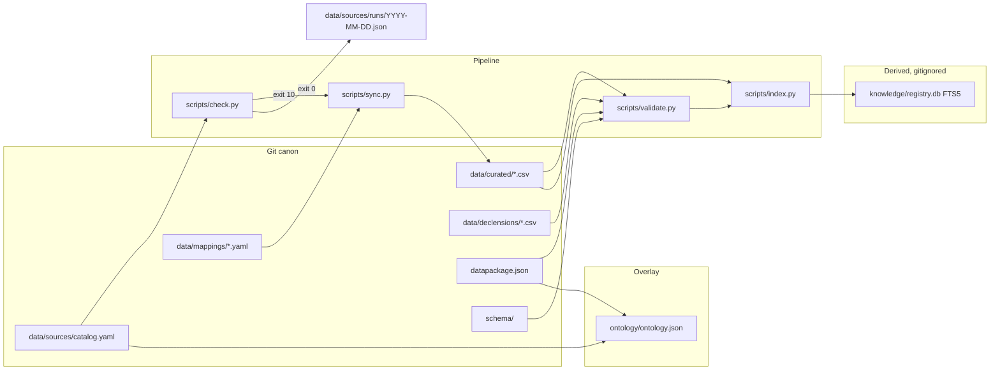

# Toponym v1 Local Registries — Implementation Design

| Field | Value |
|---|---|
| **Document** | Implementation design and full-cycle plan for `unhexx/toponym` v1 |
| **Author** | Engineering (product repo) |
| **Date** | 2026-09-09 |
| **Status** | Active |
| **CalVer target** | `2026.09.09` |
| **ADR** | [`LOCAL_REGISTRIES_DESIGN_AND_ROADMAP.md`](LOCAL_REGISTRIES_DESIGN_AND_ROADMAP.md) (DEC-REG-001) |
| **Spec** | [`TASK_SPECIFICATION.md`](TASK_SPECIFICATION.md) |
| **Operational plan** | [`CYCLE_PLAN.md`](CYCLE_PLAN.md) (repo root; execute from here) |

This is not a greenfield vision. DEC-REG-001 already chose Frictionless CSV in git, derived SQLite FTS, and an Outpost ontology overlay. This document freezes interfaces, seed policy, CLI, tests, and one independently mergeable PR per INVEST cycle P0–P9 so an engineer can implement without guessing.

Operator overrides of the ADR (binding):

1. Agentix consumer-starter **full** is already installed (sibling symlink, not a vendored tree).
2. All development cycles are planned; the executable plan lives at repo root as `CYCLE_PLAN.md`.
3. After each completed INVEST cycle: merge to `main` and `git push origin main` (overrides ADR §9.1 “do not merge until operator accepts Reviewer DONE”).
4. Commits in natural Russian, as a human mid/senior developer. Never mention models, agents, LLM, Grok, Claude, or AI.
5. Continue until a full v1 release (tag `2026.09.09` / GitHub Release). Empty commits forbidden.

---

## Overview

`unhexx/toponym` is a scaffold: Frictionless `datapackage.json` lists 11 resources, but git only contains `data/curated/types.csv` plus a thin `data/sources/catalog.yaml`. CHANGELOG already claims seeds that are not in the tree. There is no `schema/`, `scripts/`, `tests/`, `ontology/`, `data/declensions/`, `data/mappings/`, or `data/raw/`. Daily automation therefore has nothing to patch and correctly no-ops.

v1 makes the listed resources real, freezes the canonical record, wires detectors (`check.py`) → upsert (`sync.py`) → invariants (`validate.py`) → FTS (`index.py`), publishes an Outpost `ontology/ontology.json` that records DEC-REG-001 and every Source, and ships a 5-minute README plus CalVer release `2026.09.09`.

Canon stays UTF-8 CSV in git. Dumps larger than 10 MB and full ГАР/ФИАС are never vendored. CC BY-SA and ODbL stay in `data/raw/<source>/`. Curated rows are typed from official names, ISO 3166-2, Wikidata (CC0), and GeoNames identifiers — not copied wholesale from ShareAlike repos.

---

## Background & Motivation

### Current state (verified 2026-09-09)

| Claim | Reality |
|---|---|
| CHANGELOG “Added: сиды ФО, субъекты, ФОИВ, гидро/оро, золотые склонения” | **False.** Only `data/curated/types.csv` (20 taxonomy rows) exists under `data/`. |
| `datapackage.json` 11 resources | 10 of 11 CSV paths **do not exist**. |
| `schema/` | **Missing.** |
| `scripts/`, `tests/`, `ontology/`, `data/declensions/`, `data/mappings/`, `data/raw/` | **Missing.** |
| `pyproject.toml` / `requirements.txt` | **Missing.** Product `.venv` exists (CPython 3.14.7) with Agentix 3.13.0 + pytest + jsonschema; **no frictionless, no PyYAML, no ruff.** |
| `.github/workflows/daily.yml` (README) | **Missing.** No `.github/` at all. |
| `docs/SOURCES.md` (README) | **Missing.** |
| `docs/TAXONOMY.md` (README) | File on disk is `docs/taxonomy.md` (Linux is case-sensitive). |
| Agentix full | **Present.** `Agent-Init.sh`, `.venv`, symlink `agentic_loop_template` → `/home/unhex/_PROJECT/agentic_loop_template` v3.13.0, living `.agent/PLAN.md` + `.agent/TODO.md`. Symlink is gitignored. |
| Git | `main` @ `4ac040f`, origin `https://github.com/unhexx/toponym.git`. Untracked: `TASK_SPECIFICATION.md`, `Agent-Init.sh`, `prompts/`, `.agent/PLAN.md`, `.agent/TODO.md`. Modified unstaged: `.gitignore`, `AGENTS.md`. `PROJECT_CONTEXT.md` is gitignored (consumer-starter rule). |

Tracked product files today: `.gitignore`, `AGENTS.md`, `CHANGELOG.md`, `CITATION.cff`, `CONTRIBUTING.md`, `LICENSE` (MIT), `LOCAL_REGISTRIES_DESIGN_AND_ROADMAP.md`, `README.md`, `agents/DAILY_UPDATE.md`, `data/curated/types.csv`, `data/sources/catalog.yaml`, `datapackage.json`, `docs/DECLENSIONS.md`, `docs/taxonomy.md`.

### Pain

- Consumers cannot `frictionless validate` or even open the advertised CSVs.
- Daily prompt (`agents/DAILY_UPDATE.md`) tells the operator to “read schema/” and patch seeds that are not there.
- `types.csv` row `oikonym` is column-shifted (`example_ru=P`, `geonames_class=населённый пункт`) — the only curated table is already dirty.
- License/review language disagrees across files (`review=gold` vs `review=true` vs CONTRIBUTING `review=false` for gold).
- Catalog has source URLs and `checked_at` but **no detectors**, so `check.py` cannot be written from the file as-is.

### Why this shape (DEC-REG-001, unchanged)

CSV + Table Schema is the interchange any app can read (Python, Go, Excel, DuckDB). Git gives review and CalVer. SQLite FTS is derived, gitignored, rebuilt by `scripts/index.py`. Ontology is an overlay, not a second canon.

---

## Goals & Non-Goals

### Goals (v1 Definition of Done)

- All 11 `datapackage.json` resources exist, UTF-8 LF comma-CSV, ≥1 data row each.
- Canonical columns frozen (places/agencies) and Table Schema published under `schema/`.
- `python scripts/check.py --json` works **without secrets**; exit `0` (no change) / `10` (changes) / `2` (error).
- `python scripts/sync.py` upserts by stable `id` and deprecates; never deletes rows.
- `python scripts/validate.py` exit `0` on the tree; a broken fixture fails.
- `python scripts/index.py` builds `knowledge/registry.db` FTS5; queries `Волга` and `МВД` hit.
- `ontology/ontology.json` is valid JSON, contains `DEC-REG-001` and one Source per catalog id.
- Daily path: either apply a delta, or write `data/sources/runs/YYYY-MM-DD.json` (and typically bump `checked_at`) — never an empty commit.
- Reviewer gate: tests green, no vendored file >10 MB, top-level type remains `toponym` (not «Торопум» as a type name).
- GitHub Release + tag `2026.09.09`.

### Non-goals (v1)

- Full import of GeoNames `RU.zip` or ГАР/ФИАС.
- Autogenerated pymorphy/Natasha rows as gold declensions.
- Rewriting the top-level taxonomy (`toponym` / oikonym / hydronym / …).
- Public HTTP API / `scripts/serve.py`.
- A second ontology format besides Outpost `ontology/ontology.json`.
- Vendoring the Agentix template tree (symlink SSOT only).
- Copying hflabs CC-BY-SA tables into `data/curated/`.
- Population time-series, polygons, GeoJSON, PostGIS.
- Municipalities, streets (hodonyms), microtoponyms as populated tables (types exist; seed tables do not).

---

## Proposed Design

### Target tree (v1)

```
toponym/
├── AGENTS.md
├── TASK_SPECIFICATION.md
├── CYCLE_PLAN.md
├── pyproject.toml                 # NEW (P0)
├── datapackage.json               # schema refs added (P0)
├── CHANGELOG.md
├── schema/
│   ├── catalog.schema.json
│   ├── mapping.schema.json
│   ├── registry.schema.json       # JSON Schema of one canonical record
│   └── table/
│       ├── types.schema.json      # Frictionless Table Schema
│       ├── places.schema.json
│       ├── agencies.schema.json
│       └── declensions.schema.json
├── data/
│   ├── curated/
│   │   ├── types.csv              # exists; patch oikonym
│   │   ├── federal-districts.csv
│   │   ├── regions.csv
│   │   ├── cities-major.csv
│   │   ├── hydronyms-major.csv
│   │   ├── oronyms-major.csv
│   │   ├── agencies-foiv.csv
│   │   └── agencies-other.csv
│   ├── declensions/
│   │   ├── regions.csv
│   │   ├── cities-major.csv
│   │   ├── agencies.csv
│   │   └── queue.csv              # optional; not a datapackage resource in v1
│   ├── mappings/
│   │   ├── geonames.yaml
│   │   ├── gkgn.yaml
│   │   ├── fias-pointer.yaml
│   │   ├── hflabs-region.yaml
│   │   └── ukase-326.yaml
│   ├── raw/
│   │   ├── README.md              # “why this dir exists”
│   │   ├── hflabs-region/SOURCE.md
│   │   ├── hflabs-city/SOURCE.md
│   │   ├── geonames-ru/SOURCE.md
│   │   └── fias-gar/SOURCE.md
│   └── sources/
│       ├── catalog.yaml           # SSOT (no root duplicate)
│       └── runs/YYYY-MM-DD.json
├── scripts/
│   ├── check.py
│   ├── sync.py
│   ├── validate.py
│   ├── index.py
│   └── lib/
│       ├── __init__.py
│       ├── csvio.py
│       ├── catalog.py
│       ├── detectors.py
│       └── upsert.py
├── knowledge/                     # gitignored derived
│   ├── registry.db
│   └── LAST_INDEX
├── ontology/
│   ├── ontology.json
│   └── ontology.schema.json
├── tests/
│   ├── conftest.py
│   ├── test_schema.py
│   ├── test_seeds.py
│   ├── test_check.py
│   ├── test_upsert.py
│   ├── test_validate.py
│   ├── test_index.py
│   ├── test_ontology.py
│   ├── test_no_vendor.py
│   └── fixtures/
├── docs/
│   ├── DECLENSIONS.md
│   ├── taxonomy.md
│   └── SOURCES.md                 # NEW (P8)
├── agents/DAILY_UPDATE.md
└── .github/workflows/ci.yml       # pytest + validate (P5)
```

`catalog.yaml` stays at `data/sources/catalog.yaml`. Do **not** add a second `catalog.yaml` at repo root (ADR tree listed both; current repo already chose `data/sources/`).

### Architecture



### Daily update sequence

```mermaid
sequenceDiagram
  participant D as Daily operator
  participant C as check.py
  participant S as sync.py
  participant V as validate.py
  participant I as index.py
  participant G as git
  D->>C: python scripts/check.py --json
  alt changed_count = 0
    C-->>D: exit 0
    D->>G: write runs/YYYY-MM-DD.json; bump checked_at if needed
    D->>G: commit chore(data): daily refresh (0 records) OR no commit if already written today
  else changed_count > 0
    C-->>D: exit 10
    D->>S: python scripts/sync.py --source ID --apply
    S->>V: python scripts/validate.py
    V->>I: python scripts/index.py
    D->>G: commit chore(data): daily refresh YYYY-MM-DD (N records, sources: …)
  else detector error
    C-->>D: exit 2 (no commit)
  end
```

### Frozen canonical record (places + agencies)

Single profile. Unused fields stay empty string. Header order is **normative** (tests assert exact header):

```
id,id_scheme,type_id,name_ru,name_yo,name_en,abbr,parent_id,admin1,lat,lon,wd,geonames,fias,oktmo,iso,status,replaced_by,source_id,source_rev,updated_at,notes
```

| Column | Type | Required | Rules |
|---|---|---|---|
| `id` | string PK | yes | `{scheme}:{value}`: `wd:Q649`, `gn:524901`, `iso:RU-MOS`, `foiv:mvd`, `fo:cfo`, `gkgn:{n}`, `fias:{guid}`, `local:{slug}` |
| `id_scheme` | string | yes | enum: `wikidata` \| `geonames` \| `iso3166-2` \| `fias` \| `gkgn` \| `foiv` \| `fo` \| `local` |
| `type_id` | string FK | yes | must exist in `data/curated/types.csv` `id` |
| `name_ru` | string | yes | NFC; `ё`→`е` **only here**; no surrounding whitespace |
| `name_yo` | string | no | original spelling with `ё` when it exists; else copy of `name_ru` or empty |
| `name_en` | string | no | English endonym/exonym |
| `abbr` | string | no | ЦФО, МВД, RU-MOS |
| `parent_id` | string | no | must exist in the **union** of curated place/agency ids when non-empty (soft FK; validated in P5) |
| `admin1` | string | no | ISO 3166-2 code (`RU-MOS`) for objects inside a subject |
| `lat` `lon` | number or empty | no | WGS84; both empty or both set; lat ∈ [-90,90], lon ∈ [-180,180] |
| `wd` | string | no | `Q` + digits, no prefix |
| `geonames` | string | no | digits only |
| `fias` | string | no | UUID |
| `oktmo` | string | no | 8 or 11 digits |
| `iso` | string | no | `RU-XX` or `RU-XXX` as in ISO 3166-2:RU |
| `status` | enum | yes | `active` \| `deprecated` |
| `replaced_by` | string | no | required when `status=deprecated` (may be empty only for “withdrawn, no successor”) — v1: required if deprecated |
| `source_id` | string FK | yes | `catalog.yaml` `sources[].id` |
| `source_rev` | string | no | ISO date or source SHA |
| `updated_at` | date | yes | `YYYY-MM-DD` |
| `notes` | string | no | free text; may mention historical typos |

**Id assignment priority (P1 freeze):**

| Table | Primary `id` | `id_scheme` |
|---|---|---|
| federal-districts | `fo:cfo` … `fo:dfo` | `fo` |
| regions with ISO 3166-2:RU | `iso:RU-MOS` | `iso3166-2` |
| regions without ISO 3166-2:RU (6) | `local:ru-crimea` etc. | `local` |
| cities-major, hydronyms, oronyms | `wd:Q…` | `wikidata` |
| agencies-foiv / agencies-other | `foiv:mvd` | `foiv` |

Never change a published `id`. To replace a row: insert the new id, set old `status=deprecated`, `replaced_by=<new id>`.

### Types table (already exists; different schema)

`data/curated/types.csv` is **not** the canonical place record. Frozen header:

```
id,level,parent_id,name_ru,name_en,name_en_alt,example_ru,geonames_class,notes
```

**P1 must patch** the `oikonym` row (stable id, not a full rewrite). Current:

```
oikonym,primary,toponym,ойконим,oikonym,settlement name|село|деревня,P,населённый пункт
```

Correct:

```
oikonym,primary,toponym,ойконим,oikonym,settlement name,Москва,P,населённый пункт; EN also place-name
```

«Торопум» invariant: forbidden as `id`, `name_ru`, or `name_en` of any types/places/agencies row. The notes cell of `toponym` may keep the phrase “на слайде опечатка «Торопум»” as documentation of the slide typo. Validators scan `id`/`name_ru`/`name_en` only.

### Declensions (gold)

Header frozen from `docs/DECLENSIONS.md` (SSOT; other docs are wrong until P8):

```
id,type_code,lemma,yo,gender,paradigm,declinable,nom,gen,dat,acc,ins,pre,loc2,review,source
```

| Field | Enum / rule |
|---|---|
| `id` | same stable id as the place/agency row |
| `type_code` | `types.csv` id (`subject`, `city`, `agency`, `potamonym`, …) |
| `gender` | `m` \| `f` \| `n` \| `pl` |
| `paradigm` | `noun_m2` \| `noun_f1` \| `noun_f3` \| `noun_n_ovo` \| `adj_m` \| `mixed_phrase` \| `pl_tantum` \| `indecl` \| `agency-head` |
| `declinable` | `always` \| `never` \| `optional` \| `not_with_generic` |
| `review` | **`gold` \| `auto` \| `needs_review`** — not a boolean |
| `source` | catalog id or `manual` |

`sync.py` **must not write** a row whose existing `review=gold`. New auto rows go to `data/declensions/queue.csv` (not a datapackage resource in v1) or into the table with `review=needs_review`.

CONTRIBUTING.md currently says `review=false` for gold — that is inverted; P8 fixes it. AGENTS.md / README `review=true` maps to `needs_review`.

### Package and runtime

New `pyproject.toml` (P0):

```toml
[build-system]
requires = ["setuptools>=68", "wheel"]
build-backend = "setuptools.build_meta"

[project]
name = "toponym"
version = "2026.09.09"
description = "Local registry of Russian toponyms and agencies"
readme = "README.md"
requires-python = ">=3.12"
license = { text = "MIT" }
dependencies = [
  "frictionless>=5.18,<6",
  "jsonschema>=4.18,<5",
  "pyyaml>=6.0,<7",
  "requests>=2.32,<3",
]

[project.optional-dependencies]
dev = ["pytest>=8.0,<9", "ruff>=0.6,<1"]

[tool.setuptools.packages.find]
include = ["scripts*"]

[tool.ruff]
target-version = "py312"
line-length = 100
src = ["scripts", "tests"]

[tool.ruff.lint]
select = ["E", "F", "I", "UP", "W"]

[tool.pytest.ini_options]
testpaths = ["tests"]
addopts = "-q"
```

Install: `uv pip install -e ".[dev]"` inside the existing `.venv` (AGENTS.md). Do not create a second venv. Do not vendor Agentix.

Shared library lives under `scripts/lib/` so `python scripts/check.py` stays the documented CLI (no console-script rename in v1).

### CSV I/O (`scripts/lib/csvio.py`)

- Open with `encoding="utf-8-sig"` on read (strip BOM if present) and write `encoding="utf-8"` **without BOM**.
- `newline=""` + `lineterminator="\n"` + `delimiter=","` + `quoting=csv.QUOTE_MINIMAL`.
- Reject CR (`\r`) on validate.
- Never rewrite a file if the byte payload is unchanged (empty-commit guard).
- Upsert is load → dict-by-id → merge → write **stable row order** (existing order, new ids appended, no sort-by-name that churns the whole file).

### Detectors and `check.py`

Catalog detector kinds (closed enum):

| `kind` | Behaviour |
|---|---|
| `http_head` | `HEAD` (fallback `GET`); compare `ETag` / `Last-Modified` / `Content-Length` to `cursor` |
| `http_dated` | Expand `{yesterday}` as UTC `YYYY-MM-DD` in each URL; `HEAD`/`GET`; `changed` if any URL returns 200 and body/length is non-empty (GeoNames mods/deletes). Also optional `also: last_modified_header` on the dump URL |
| `github_commits` | `GET https://api.github.com/repos/{repo}/commits?since={checked_at}&per_page=1`. Unauthenticated is enough (60 req/h). Use `GITHUB_TOKEN` if set. `changed` if newest SHA ≠ `cursor` |
| `page_fingerprint` | `GET` HTML; strip scripts/styles; collapse whitespace; SHA-256 hex; compare to `cursor` |
| `none` | Never reports `changed` automatically. Human gate (official PDF of the ukase) |

Timeouts: 15 s per URL. User-Agent: `toponym-check/2026.09.09 (+https://github.com/unhexx/toponym)`. No retries beyond one. Network errors → that source `error=true`, process exit `2` if any error.

CLI:

```
python scripts/check.py [--json] [--source ID] [--offline]
```

- `--offline`: do not hit the network; compare nothing; exit `2` unless every selected source is `kind: none` (then exit `0`). Used by unit tests with fixtures, not by daily.
- Tests inject a `requests` Session / monkeypatch.

Stdout JSON shape (normative):

```json
{
  "as_of": "2026-09-09T10:00:00Z",
  "sources": [
    {
      "id": "geonames-ru",
      "changed": false,
      "reason": "0 RU rows in mods",
      "cursor_old": "2026-09-08",
      "cursor_new": "2026-09-08",
      "error": false
    }
  ],
  "changed_count": 0,
  "error_count": 0
}
```

Exit codes: `0` no change and no errors; `10` `changed_count > 0` and `error_count = 0`; `2` `error_count > 0` (even if some sources changed).

### `sync.py`

```
python scripts/sync.py [--source ID | --all] [--apply] [--dry-run]
```

Default is **dry-run** (print intended upsert/deprecate counts, write nothing). `--apply` writes. `--dry-run` is explicit alias of default.

Rules:

1. Read mapping `data/mappings/<id>.yaml` and catalog row.
2. If `vendor: true` and remote `Content-Length` > `max_vendor_bytes` (default 10485760) → refuse, exit `2`.
3. If `vendor: false` → do not download the dump. For GeoNames, fetch only `modifications-{date}.txt` and `deletes-{date}.txt` (small). For pointer sources, update `checked_at`/`cursor` only.
4. Upsert by `id`. Incoming delete / GeoNames deletes file → `status=deprecated`; do not drop the row. If a replacement id is known, set `replaced_by`.
5. Skip writes into `data/declensions/*` when the existing row has `review=gold`.
6. Set `source_id`, `source_rev`, `updated_at=today`.
7. After apply: do not call validate internally (caller does); but refuse to write a row missing required columns.

v1 `sync.py` **implemented backends** (must have tests):

| Source | Backend |
|---|---|
| `geonames-ru` | Parse GeoNames TSV mods/deletes (country `RU` only); map via `geonames.yaml`; upsert/deprecate |
| `ukase-326` | No automatic HTML scrape into curated. `--apply` only refreshes `checked_at` unless `--manual-file PATH` is passed (operator-prepared CSV) |
| `hflabs-region`, `hflabs-city` | Pointer: refresh cursor/SHA only. **Never copy rows into curated** |
| `fias-gar`, `gkgn-opendata` | Pointer: refresh `checked_at` only |
| others | `checked_at` bump only |

A unit-test fixture must prove: 2-row CSV + 1 new incoming id → 3 rows; incoming delete of id A → A still present with `status=deprecated`.

### `validate.py`

```
python scripts/validate.py [--datapackage PATH] [--json]
```

Exit `0` ok, `1` one or more errors, `2` crash / missing file.

Checks, in order:

1. `frictionless validate datapackage.json` (schema + encoding).
2. Every resource path exists and has a header + ≥1 data row.
3. Unique `id` **per file** and unique `id` across the union of places+agencies (declensions ids may repeat the place id).
4. `type_id` ∈ `types.csv`.
5. `source_id` ∈ catalog (except `types.csv`, which has no `source_id`).
6. `status` ∈ {`active`,`deprecated`}.
7. `id`/`name_ru`/`name_en` do not equal or equal-ignore-case `торопум` / `Торопум`.
8. File is UTF-8, no CR, comma delimiter.
9. `name_ru` contains no `ё`/`Ё`.
10. `parent_id` empty or exists in the union of curated ids (types parent_id is types-internal).
11. No file under `data/raw/` or `data/curated/` exceeds 10 MB.
12. `iso` unique among regions where non-empty.
13. Federal districts count = 8; regions count = 89.

### `index.py`

```
python scripts/index.py [--out knowledge/registry.db]
```

Creates parent dir. Rebuilds from scratch (not incremental in v1). Gitignore already has `knowledge/*.db` and `knowledge/LAST_INDEX`.

```sql
CREATE TABLE records (
  id TEXT PRIMARY KEY,
  table_name TEXT NOT NULL,
  type_id TEXT,
  name_ru TEXT,
  name_yo TEXT,
  name_en TEXT,
  abbr TEXT,
  parent_id TEXT,
  admin1 TEXT,
  wd TEXT,
  geonames TEXT,
  iso TEXT,
  status TEXT,
  source_id TEXT
);
CREATE VIRTUAL TABLE records_fts USING fts5(
  name_ru, name_yo, name_en, abbr, wd,
  content='records', content_rowid='rowid',
  tokenize='unicode61'
);
CREATE TABLE sync_meta (
  source_id TEXT PRIMARY KEY,
  checked_at TEXT,
  cursor TEXT,
  hash TEXT
);
```

FTS triggers (insert/delete) on `records`. Load every curated places/agencies CSV. `sync_meta` from catalog.

Acceptance query (pytest):

```sql
SELECT r.id FROM records_fts f
JOIN records r ON r.rowid = f.rowid
WHERE records_fts MATCH 'Волга';
-- ≥1 row, hydronym Волга

SELECT r.id FROM records_fts f
JOIN records r ON r.rowid = f.rowid
WHERE records_fts MATCH 'МВД';
-- foiv:mvd
```

`LAST_INDEX` is one line: ISO timestamp + row count.

### Outpost ontology (`ontology/ontology.json`)

ADR: “формат Outpost”, entities Project / Artifact / Decision / Source / Mapping / Check / Risk / Lesson / Registry. There is no second schema in-tree; freeze this JSON (P7 also adds `ontology/ontology.schema.json`).

```json
{
  "schema": "outpost-ontology/v1",
  "project": {
    "id": "PRJ-TOPONYM",
    "name": "toponym",
    "calver": "2026.09.09",
    "canon": "frictionless-tabular-data-package"
  },
  "entities": [
    {
      "id": "DEC-REG-001",
      "type": "Decision",
      "title": "Canon = git + Frictionless Tabular Data Package",
      "status": "accepted",
      "date": "2026-09-09",
      "refs": ["LOCAL_REGISTRIES_DESIGN_AND_ROADMAP.md"]
    }
  ]
}
```

Required entity types and ids:

| Type | Ids |
|---|---|
| Project | `PRJ-TOPONYM` |
| Artifact | `ART-CATALOG`, `ART-DATAPACKAGE`, `ART-SCHEMA` |
| Decision | `DEC-REG-001` |
| Registry | `REG-PLACES`, `REG-AGENCIES`, `REG-DECLENSIONS`, `REG-TYPES` |
| Source | `SRC-{catalog.id}` uppercased with hyphens, e.g. `SRC-GEONAMES-RU`, one per catalog source |
| Mapping | `MAP-GN-CANON`, `MAP-GKGN`, `MAP-FIAS-POINTER`, `MAP-HFLABS-REGION`, `MAP-UKASE-326` |
| Check | `CHK-DETECTOR` (class of check.py; instance checks live in runs/, not in ontology) |
| Risk | `RSK-FIAS-VENDOR`, `RSK-CCBYSA-CURATED`, `RSK-EMPTY-COMMIT` |
| Lesson | `LSN-SEEDS-MISSING` — daily no-op was caused by CHANGELOG claiming seeds that were not in git |

P7 tests: JSON parses; schema validates; `DEC-REG-001` present; `len(Source) == len(catalog.sources)`.

---

## API / Interface Changes

There is no HTTP API in v1. The interface is files + four CLIs.

### `datapackage.json` (P0 change)

Keep existing resource names/paths. Add `schema` to each resource. Add package-level `resources[].dialect`:

```json
{
  "name": "toponym",
  "title": "Реестр российских топонимов",
  "profile": "tabular-data-package",
  "version": "2026.09.09",
  "license": "MIT",
  "homepage": "https://github.com/unhexx/toponym",
  "resources": [
    {
      "name": "types",
      "path": "data/curated/types.csv",
      "format": "csv",
      "encoding": "utf-8",
      "dialect": { "delimiter": ",", "lineTerminator": "\n", "header": true },
      "schema": "schema/table/types.schema.json"
    },
    {
      "name": "federal-districts",
      "path": "data/curated/federal-districts.csv",
      "schema": "schema/table/places.schema.json"
    }
  ]
}
```

`places.schema.json` is shared by federal-districts, regions, cities-major, hydronyms-major, oronyms-major. `agencies.schema.json` shared by agencies-foiv and agencies-other. `declensions.schema.json` shared by the three declension resources.

Until P1 creates the CSVs, `frictionless validate` will fail on missing paths — **P0 tests validate JSON Schema of `schema/*.json` and catalog.yaml against `catalog.schema.json`, not the full package**. P5 is the first cycle where `validate.py` on the real package must exit 0.

### Catalog YAML (P0 extends in place)

`data/sources/catalog.yaml` remains SSOT. P0 adds detector blocks so P3 does not invent keys. Sketch of the geonames entry after P0:

```yaml
updated: 2026-09-09
sources:
  - id: geonames-ru
    title: GeoNames RU dump
    url: https://download.geonames.org/export/dump/RU.zip
    license: CC-BY-4.0
    vendor: false
    max_vendor_bytes: 10485760
    detector:
      kind: http_dated
      urls:
        - https://download.geonames.org/export/dump/modifications-{yesterday}.txt
        - https://download.geonames.org/export/dump/deletes-{yesterday}.txt
      also: last_modified_header
      dump_url: https://download.geonames.org/export/dump/RU.zip
    checked_at: 2026-09-09
    cursor: "2026-09-08"
    stale_after_days: 2
```

Required keys per source (catalog.schema.json): `id` (pattern `^[a-z0-9-]+$`), `license`, `vendor` (bool), `detector` (`kind` + kind-specific fields), `checked_at` (date). Optional: `url`, `title`, `max_vendor_bytes`, `cursor`, `stale_after_days`, `notes`.

Watchlist stays as `watchlist_github: [owner/repo, …]` and is **not** auto-fetched in v1 beyond sources that already have `github_commits` detectors (`hflabs-region`, `hflabs-city`, optionally the other GitHub ids with `kind: github_commits` and `vendor: false`).

### Mapping YAML (P2)

`schema/mapping.schema.json` required properties: `source_id`, `stable_id`, `delete_policy` (`deprecate` only in v1), `fields` (object of canonical_field → source_field). Optional: `class_map`, `filter`, `pointer` (bool), `notes`.

---

## Data Model Changes

### Places Table Schema (Frictionless)

`schema/table/places.schema.json` — fields matching the frozen header; `primaryKey: id`; `missingValues: [""]`. `lat`/`lon` type `number`. `status` enum. `id_scheme` enum. Constraints `required` on `id`, `id_scheme`, `type_id`, `name_ru`, `status`, `source_id`, `updated_at`.

Agencies table schema is the same fields (agencies simply leave geo empty). Keeping two files lets us tighten `type_id` pattern later (`agency` vs place types) without a format break.

### Seed policy and actual v1 rows

**License rule for every seed row:** type the name from an official or CC0/CC-BY (not SA) source; store identifiers (ISO, Wikidata Q, GeoNames id, FIAS GUID if known from official docs). Do **not** paste hflabs CSV. `source_id` on official-name rows is `wikidata` or `ukase-326` or `gkgn-opendata` (names), never `hflabs-region`.

Attribution for GeoNames-derived coordinates (if used): `source_id=geonames-ru`, CC-BY-4.0 — compatible with MIT **with attribution** in `docs/SOURCES.md` and the row’s `source_id`. Coordinates may be left empty in v1 if not looked up from a compatible source.

#### 1. Federal districts — 8 rows (`data/curated/federal-districts.csv`)

`type_id=federal-district`. `parent_id` empty. `source_id=wikidata`. Abbr as used by the Bank of Russia / common official short forms.

| id | abbr | name_ru | name_en | admin centre (notes) |
|---|---|---|---|---|
| `fo:cfo` | ЦФО | Центральный федеральный округ | Central Federal District | Москва |
| `fo:szfo` | СЗФО | Северо-Западный федеральный округ | Northwestern Federal District | Санкт-Петербург |
| `fo:ufo` | ЮФО | Южный федеральный округ | Southern Federal District | Ростов-на-Дону |
| `fo:skfo` | СКФО | Северо-Кавказский федеральный округ | North Caucasian Federal District | Пятигорск |
| `fo:pfo` | ПФО | Приволжский федеральный округ | Volga Federal District | Нижний Новгород |
| `fo:urfo` | УрФО | Уральский федеральный округ | Ural Federal District | Екатеринбург |
| `fo:sfo` | СФО | Сибирский федеральный округ | Siberian Federal District | Новосибирск |
| `fo:dfo` | ДФО | Дальневосточный федеральный округ | Far Eastern Federal District | Владивосток |

Public sources: Указ Президента РФ от 13.05.2000 № 849 (as amended); Wikidata; Wikipedia “Федеральные округа Российской Федерации”. Fill `wd` at seed time from Wikidata (do not invent Q-ids in this design).

#### 2. Subjects — 89 rows (`data/curated/regions.csv`)

`type_id=subject`. `parent_id` = federal district id. `iso` filled for the 83 codes in ISO 3166-2:RU. `admin1` = the ISO code when present.

**Coverage policy (explicit):** the registry follows the list of subjects in Article 65 of the Constitution of the Russian Federation (89). ISO 3166-2:RU currently assigns codes to 83 of them. The other six have **no** ISO 3166-2:RU code; ISO 3166-2:UA assigns codes internationally. v1 stores those six with `id_scheme=local`, empty `iso`, and a factual `notes` cell citing both ISO entries and GOST 7.67-2024. This is identifier documentation, not a political essay.

**Cities-major does not seed settlements in those six subjects** (see cities policy). Regions table still has 89 choronym rows.

ISO 3166-2:RU (83) — `id = iso:{code}`:

**Republics (21):** RU-AD Адыгея; RU-AL Алтай; RU-BA Башкортостан; RU-BU Бурятия; RU-DA Дагестан; RU-IN Ингушетия; RU-KB Кабардино-Балкария; RU-KL Калмыкия; RU-KC Карачаево-Черкесия; RU-KR Карелия; RU-KO Коми; RU-ME Марий Эл; RU-MO Мордовия; RU-SA Саха (Якутия); RU-SE Северная Осетия — Алания; RU-TA Татарстан; RU-TY Тыва; RU-UD Удмуртия; RU-KK Хакасия; RU-CE Чечня; RU-CU Чувашия.

**Krais (9):** RU-ALT Алтайский край; RU-ZAB Забайкальский край; RU-KAM Камчатский край; RU-KDA Краснодарский край; RU-KYA Красноярский край; RU-PER Пермский край; RU-PRI Приморский край; RU-STA Ставропольский край; RU-KHA Хабаровский край.

**Oblasts (46):** RU-AMU Амурская; RU-ARK Архангельская; RU-AST Астраханская; RU-BEL Белгородская; RU-BRY Брянская; RU-VLA Владимирская; RU-VGG Волгоградская; RU-VLG Вологодская; RU-VOR Воронежская; RU-IVA Ивановская; RU-IRK Иркутская; RU-KGD Калининградская; RU-KLU Калужская; RU-KEM Кемеровская; RU-KIR Кировская; RU-KOS Костромская; RU-KGN Курганская; RU-KRS Курская; RU-LEN Ленинградская; RU-LIP Липецкая; RU-MAG Магаданская; RU-MOS Московская; RU-MUR Мурманская; RU-NIZ Нижегородская; RU-NGR Новгородская; RU-NVS Новосибирская; RU-OMS Омская; RU-ORE Оренбургская; RU-ORL Орловская; RU-PNZ Пензенская; RU-PSK Псковская; RU-ROS Ростовская; RU-RYA Рязанская; RU-SAK Сахалинская; RU-SAM Самарская; RU-SAR Саратовская; RU-SMO Смоленская; RU-SVE Свердловская; RU-TAM Тамбовская; RU-TVE Тверская; RU-TOM Томская; RU-TUL Тульская; RU-TYU Тюменская; RU-ULY Ульяновская; RU-CHE Челябинская; RU-YAR Ярославская.

**Federal cities (2):** RU-MOW Москва; RU-SPE Санкт-Петербург.

**Autonomous oblast (1):** RU-YEV Еврейская автономная область.

**Autonomous okrugs (4):** RU-NEN Ненецкий; RU-KHM Ханты-Мансийский — Югра; RU-CHU Чукотский; RU-YAN Ямало-Ненецкий.

**Six without ISO 3166-2:RU** (Constitution Art. 65; ISO notes):

| id | name_ru | parent_id | notes (factual) |
|---|---|---|---|
| `local:ru-crimea` | Республика Крым | `fo:ufo` | ISO 3166-2:RU — none; ISO 3166-2:UA `UA-43`; GOST 7.67-2024 `RU-KR` / `RU-KRY` |
| `local:ru-sevastopol` | Севастополь | `fo:ufo` | ISO 3166-2:UA `UA-40`; GOST `RU-SEV` |
| `local:ru-dnr` | Донецкая Народная Республика | `fo:ufo` | ISO 3166-2:UA `UA-14`; GOST `RU-DN` / `RU-DON` |
| `local:ru-lnr` | Луганская Народная Республика | `fo:ufo` | ISO 3166-2:UA `UA-09`; GOST `RU-LN` / `RU-LUG` |
| `local:ru-zaporozhye` | Запорожская область | `fo:ufo` | ISO 3166-2:UA `UA-23`; GOST `RU-ZP` |
| `local:ru-kherson` | Херсонская область | `fo:ufo` | ISO 3166-2:UA `UA-65`; GOST `RU-KS` |

`name_ru` uses the official constitutional names. `name_yo` empty unless `ё` appears (Орловская → `name_ru` Орловская, no yo).

**Federal district membership (parent_id)** — 83 ISO subjects:

| FO | Subjects (ISO codes) |
|---|---|
| `fo:cfo` | BEL BRY VLA VOR IVA KLU KOS KRS LIP MOS ORL RYA SMO TAM TVE TUL YAR MOW (18) |
| `fo:szfo` | KR KO ARK VLG KGD LEN MUR NGR PSK SPE NEN (11) |
| `fo:ufo` | AD KL KDA AST VGG ROS + six local:* (8 ISO + 6) |
| `fo:skfo` | DA IN KB KC SE STA CE (7) |
| `fo:pfo` | BA ME MO TA UD CU PER KIR NIZ ORE PNZ SAM SAR ULY (14) |
| `fo:urfo` | KGN SVE TYU CHE KHM YAN (6) |
| `fo:sfo` | AL TY KK ALT KYA IRK KEM NVS OMS TOM (10) |
| `fo:dfo` | BU SA ZAB KAM PRI KHA AMU MAG SAK YEV CHU (11) |

Sources: Constitution Art. 65; ISO 3166-2:RU (ISO 3166 Newsletter / Wikipedia ISO 3166-2:RU); GOST 7.67-2024; official names as in Конституция РФ / ГОСТ.

Acceptance: `wc -l` = 90 (header+89); 83 non-empty unique `iso`; 6 empty `iso` with `id_scheme=local`.

#### 3. Cities-major — policy + required named set

**Policy (frozen):**

Include a city if **any** of:

1. Population ≥ 100 000 (Rosstat estimate, latest published 1 Jan 2024 or 2025) **and** `admin1` is one of the 83 ISO 3166-2:RU codes.
2. It is the administrative centre of one of those 83 subjects (even if <100k: Горно-Алтайск, Нарьян-Мар, Анадырь, Магас, Салехард, Ханты-Мансийск, Биробиджан, …).
3. It is a DECLENSIONS.md fixture: Москва, Нижний Новгород, Сочи, Орёл, Пушкин (Санкт-Петербург), Жуковский, Домодедово.

**Exclude:** settlements whose `admin1` would be one of the six `local:*` subjects (v1). Can be added later as a dated decision.

**Do not** copy `hflabs/city` or `epogrebnyak/ru-cities` files. Build rows as: official Russian name + Wikidata Q-id (CC0) + GeoNames id if looked up + ISO `admin1`. `source_id=wikidata`.

**Count target:** ≥150 rows (historically ~170 cities ≥100k plus ~10 small capitals). Test: `>= 150` and every fixture id present.

**Required fixtures (must exist; `id` = Wikidata):**

| id | name_ru | admin1 | notes |
|---|---|---|---|
| `wd:Q649` | Москва | RU-MOW | also a subject; city row is the oikonym, region row is the subject |
| `wd:Q656` | Санкт-Петербург | RU-SPE | |
| `wd:Q959` | Новосибирск | RU-NVS | |
| `wd:Q887` | Екатеринбург | RU-SVE | |
| `wd:Q894` | Казань | RU-TA | |
| `wd:Q908` | Нижний Новгород | RU-NIZ | mixed_phrase declension |
| `wd:Q954` | Челябинск | RU-CHE | |
| `wd:Q883` | Самара | RU-SAM | |
| `wd:Q656` is SPb; `wd:Q3426` Омск; `wd:Q133315` Ростов-на-Дону; `wd:Q875` Уфа; `wd:Q919` Красноярск; `wd:Q3113` Воронеж; `wd:Q268` Пермь; `wd:Q5627` Волгоград; `wd:Q957` Краснодар |
| `wd:Q7525` | Сочи | RU-KDA | indecl |
| `wd:Q3118` | Орёл | RU-ORL | `name_yo=Орёл`, `name_ru=Орел` |
| `wd:Q7945` | Пушкин | RU-SPE | творительный *Пушкином* |
| `wd:Q102618` | Жуковский | RU-MOS | adj_m |
| `wd:Q102618` wait Жуковский Q102618; Домодедово `wd:Q102467` | Домодедово | RU-MOS | noun_n_ovo, declinable=optional |

(Implementer verifies Q-ids against Wikidata at P1; the names and admin1 are binding, Q-ids in this table are the expected ones and must be checked, not invented.)

The remaining ≥100k list is produced at P1 from a Wikidata SPARQL query `P31=Q515` (city) / `P17=Q159` with `P1082` population ≥100000, plus Rosstat names for spelling. Store the SPARQL in `data/raw/wikidata/cities-major.sparql` (tiny file, not a dump).

#### 4. Hydronyms-major — named list (`type_id` potamonym / limnonym / hydronym)

`source_id=wikidata`. Approximate coordinates optional.

**Rivers (`potamonym`):** Волга, Обь, Енисей, Лена, Амур, Иртыш, Дон, Кама, Ока, Ангара, Печора, Северная Двина, Кубань, Терек, Урал (река), Нева, Москва (река), Колыма, Индигирка, Яна, Зея, Томь, Белая (Агидель), Вятка, Алдан, Вилюй, Селенга, Шилка, Аргунь.

**Lakes / seas (`limnonym` or `hydronym`):** Байкал, Ладожское озеро, Онежское озеро, Таймыр, Ханка, Ильмень, Чудско-Псковское озеро, Телецкое озеро, Каспийское море, Чёрное море, Азовское море, Балтийское море, Белое море, Баренцево море, Карское море, Охотское море, Берингово море.

Acceptance: ≥40 rows; must include Волга, Байкал, Дон, Нева, Обь, Енисей, Лена, Амур. Дон has `loc2` in declensions (*на Дону*).

#### 5. Oronyms-major — named list

**Ranges / peaks (`oronym`):** Эльбрус, Казбек, Белуха, Народная, Ключевская Сопка, Уральские горы, Большой Кавказ, Алтай, Западный Саян, Восточный Саян, Сихотэ-Алинь, Верхоянский хребет, хребет Черского, Становой хребет, Хибины, плато Путорана, Валдайская возвышенность, Среднерусская возвышенность.

**Insulonyms (`insulonym`, allowed in this table in v1):** Сахалин, Курильские острова, Новая Земля, Земля Франца-Иосифа, Командорские острова, полуостров Камчатка, полуостров Таймыр, полуостров Ямал, Кольский полуостров.

Acceptance: ≥25 rows; must include Эльбрус, Уральские горы, Сахалин, Байкал is **not** an oronym (it lives in hydronyms).

#### 6. FOIV — Указ № 326 (11.05.2024) as amended by № 522 (17.06.2024)

All of the following are **in v1** `data/curated/agencies-foiv.csv`. `type_id=agency`. `id=foiv:{slug}`. `parent_id` = supervising ministry’s id when the ukase nests the body; empty for bodies under the President or Government directly.

Official names from the ukase; abbreviations from the conventional short names used in the same Wikipedia/consultant structure article (verify against the official text at P1). `source_id=ukase-326`. `source_rev=2024-06-17`.

**I. Under the President**

| id | abbr | name_ru | parent_id |
|---|---|---|---|
| `foiv:mvd` | МВД | Министерство внутренних дел Российской Федерации | |
| `foiv:mchs` | МЧС | Министерство Российской Федерации по делам гражданской обороны, чрезвычайным ситуациям и ликвидации последствий стихийных бедствий | |
| `foiv:mid` | МИД | Министерство иностранных дел Российской Федерации | |
| `foiv:rs` | Россотрудничество | Федеральное агентство по делам СНГ, соотечественников, проживающих за рубежом, и по международному гуманитарному сотрудничеству | `foiv:mid` |
| `foiv:mod` | Минобороны | Министерство обороны Российской Федерации | |
| `foiv:fstec` | ФСТЭК | Федеральная служба по техническому и экспортному контролю | `foiv:mod` |
| `foiv:minjust` | Минюст | Министерство юстиции Российской Федерации | |
| `foiv:fsin` | ФСИН | Федеральная служба исполнения наказаний | `foiv:minjust` |
| `foiv:fssp` | ФССП | Федеральная служба судебных приставов | `foiv:minjust` |
| `foiv:gfs` | ГФС | Государственная фельдъегерская служба Российской Федерации | |
| `foiv:svr` | СВР | Служба внешней разведки Российской Федерации | |
| `foiv:fsb` | ФСБ | Федеральная служба безопасности Российской Федерации | |
| `foiv:rosgvardiya` | Росгвардия | Федеральная служба войск национальной гвардии Российской Федерации | |
| `foiv:fso` | ФСО | Федеральная служба охраны Российской Федерации | |
| `foiv:fsvts` | ФСВТС | Федеральная служба по военно-техническому сотрудничеству | |
| `foiv:rosfinmonitoring` | Росфинмониторинг | Федеральная служба по финансовому мониторингу | |
| `foiv:rosarhiv` | Росархив | Федеральное архивное агентство | |
| `foiv:fmba` | ФМБА | Федеральное медико-биологическое агентство | |
| `foiv:gusp` | ГУСП | Главное управление специальных программ Президента Российской Федерации | |
| `foiv:udp` | УДП | Управление делами Президента Российской Федерации | |

ФМБА is listed under the President by Указ № 522 (17.06.2024) — notes must say so.

**II. Ministries under the Government + subordinated services/agencies**

| id | abbr | name_ru | parent |
|---|---|---|---|
| `foiv:minzdrav` | Минздрав | Министерство здравоохранения Российской Федерации | |
| `foiv:roszdravnadzor` | Росздравнадзор | Федеральная служба по надзору в сфере здравоохранения | minzdrav |
| `foiv:minkultury` | Минкультуры | Министерство культуры Российской Федерации | |
| `foiv:minobrnauki` | Минобрнауки | Министерство науки и высшего образования Российской Федерации | |
| `foiv:minprirody` | Минприроды | Министерство природных ресурсов и экологии Российской Федерации | |
| `foiv:rosgidromet` | Росгидромет | Федеральная служба по гидрометеорологии и мониторингу окружающей среды | minprirody |
| `foiv:rpn` | Росприроднадзор | Федеральная служба по надзору в сфере природопользования | minprirody |
| `foiv:rosvodresursy` | Росводресурсы | Федеральное агентство водных ресурсов | minprirody |
| `foiv:rosleshoz` | Рослесхоз | Федеральное агентство лесного хозяйства | minprirody |
| `foiv:rosnedra` | Роснедра | Федеральное агентство по недропользованию | minprirody |
| `foiv:minpromtorg` | Минпромторг | Министерство промышленности и торговли Российской Федерации | |
| `foiv:rosstandart` | Росстандарт | Федеральное агентство по техническому регулированию и метрологии | minpromtorg |
| `foiv:minprosveshcheniya` | Минпросвещения | Министерство просвещения Российской Федерации | |
| `foiv:minvr` | Минвостокразвития | Министерство Российской Федерации по развитию Дальнего Востока и Арктики | |
| `foiv:mcx` | Минсельхоз | Министерство сельского хозяйства Российской Федерации | |
| `foiv:fsvps` | Россельхознадзор | Федеральная служба по ветеринарному и фитосанитарному надзору | mcx |
| `foiv:rosrybolovstvo` | Росрыболовство | Федеральное агентство по рыболовству | mcx |
| `foiv:minsport` | Минспорт | Министерство спорта Российской Федерации | |
| `foiv:minstroy` | Минстрой | Министерство строительства и жилищно-коммунального хозяйства Российской Федерации | |
| `foiv:mintrans` | Минтранс | Министерство транспорта Российской Федерации | |
| `foiv:rostransnadzor` | Ространснадзор | Федеральная служба по надзору в сфере транспорта | mintrans |
| `foiv:favt` | Росавиация | Федеральное агентство воздушного транспорта | mintrans |
| `foiv:rosavtodor` | Росавтодор | Федеральное дорожное агентство | mintrans |
| `foiv:roszeldor` | Росжелдор | Федеральное агентство железнодорожного транспорта | mintrans |
| `foiv:morflot` | Росморречфлот | Федеральное агентство морского и речного транспорта | mintrans |
| `foiv:mintrud` | Минтруд | Министерство труда и социальной защиты Российской Федерации | |
| `foiv:rostrud` | Роструд | Федеральная служба по труду и занятости | mintrud |
| `foiv:minfin` | Минфин | Министерство финансов Российской Федерации | |
| `foiv:fns` | ФНС | Федеральная налоговая служба | minfin |
| `foiv:probpalata` | Пробирная палата | Федеральная пробирная палата | minfin |
| `foiv:ralco` | Росалкогольтабакконтроль | Федеральная служба по контролю за алкогольным и табачным рынками | minfin |
| `foiv:fts` | ФТС | Федеральная таможенная служба | minfin |
| `foiv:roskazna` | Казначейство | Федеральное казначейство | minfin |
| `foiv:rosimushchestvo` | Росимущество | Федеральное агентство по управлению государственным имуществом | minfin |
| `foiv:minkomsvyaz` | Минцифры | Министерство цифрового развития, связи и массовых коммуникаций Российской Федерации | |
| `foiv:rkn` | Роскомнадзор | Федеральная служба по надзору в сфере связи, информационных технологий и массовых коммуникаций | minkomsvyaz |
| `foiv:economy` | Минэкономразвития | Министерство экономического развития Российской Федерации | |
| `foiv:rsacc` | Росаккредитация | Федеральная служба по аккредитации | economy |
| `foiv:rosstat` | Росстат | Федеральная служба государственной статистики | economy |
| `foiv:rospatent` | Роспатент | Федеральная служба по интеллектуальной собственности | economy |
| `foiv:minenergo` | Минэнерго | Министерство энергетики Российской Федерации | |

**III. Services/agencies under the Government directly**

| id | abbr | name_ru |
|---|---|---|
| `foiv:fas` | ФАС | Федеральная антимонопольная служба |
| `foiv:rosreestr` | Росреестр | Федеральная служба государственной регистрации, кадастра и картографии |
| `foiv:rospotrebnadzor` | Роспотребнадзор | Федеральная служба по надзору в сфере защиты прав потребителей и благополучия человека |
| `foiv:obrnadzor` | Рособрнадзор | Федеральная служба по надзору в сфере образования и науки |
| `foiv:gosnadzor` | Ростехнадзор | Федеральная служба по экологическому, технологическому и атомному надзору |
| `foiv:rosrezerv` | Росрезерв | Федеральное агентство по государственным резервам |
| `foiv:fadm` | Росмолодёжь | Федеральное агентство по делам молодёжи |
| `foiv:fadn` | ФАДН | Федеральное агентство по делам национальностей |

Acceptance: ≥69 FOIV rows; `foiv:mvd` and `foiv:fmba` present; ФМБА notes mention № 522.

Public sources: Указ Президента РФ от 11.05.2024 № 326; Указ от 17.06.2024 № 522; publication on pravo.gov.ru; ConsultantPlus text “ред. от 17.06.2024”. Wikipedia article is a **fingerprint URL** for `page_fingerprint`, not the legal source.

#### 7. agencies-other (not in the ukase structure)

Bodies that applications still look up next to FOIV. `source_id=wikidata` (or `manual`). ≥10 rows:

| id | abbr | name_ru |
|---|---|---|
| `foiv:genproc` | Генпрокуратура | Генеральная прокуратура Российской Федерации |
| `foiv:skr` | СК России | Следственный комитет Российской Федерации |
| `foiv:cbr` | Банк России | Центральный банк Российской Федерации |
| `foiv:ach` | Счётная палата | Счётная палата Российской Федерации |
| `foiv:ksrf` | КС РФ | Конституционный Суд Российской Федерации |
| `foiv:vsrf` | ВС РФ | Верховный Суд Российской Федерации |
| `foiv:cik` | ЦИК России | Центральная избирательная комиссия Российской Федерации |
| `foiv:ap` | АП | Администрация Президента Российской Федерации |
| `foiv:govstaff` | Аппарат Правительства | Аппарат Правительства Российской Федерации |
| `foiv:sovbez` | Совбез | Совет Безопасности Российской Федерации |

#### 8. Gold declensions

**Must be `review=gold`:** every fixture in `docs/DECLENSIONS.md` §фикстуры (Москва; Нижний Новгород; Сочи; Орёл; Пушкин *Пушкином*; Жуковский; Домодедово; Дон *на Дону*; МВД / Министерство внутренних дел); all 8 federal districts (mostly `adj_m` / mixed); all 89 subject lemmas; all FOIV **abbreviations** (`declinable=never`, paradigm `indecl`) plus `agency-head` rows for МВД, МИД, Минфин, Минобороны, Росгвардия.

**May be `needs_review`:** remaining cities-major and remaining FOIV full names.

Rosгвардия: declinable (docs). Сочи, Тольятти, Улан-Удэ: `never`. Домодедово: `optional`.

`data/declensions/regions.csv` covers FO + subjects (type_code `federal-district` / `subject`). `cities-major.csv` covers cities. `agencies.csv` covers FOIV + other.

### hflabs / CC-BY-SA

hflabs/region and hflabs/city are CC-BY-SA-4.0. ShareAlike is **not** compatible with putting their rows into an MIT `data/curated/` table.

v1 approach (frozen):

- `data/raw/hflabs-region/SOURCE.md` and `data/raw/hflabs-city/SOURCE.md` — URL, license, “do not vendor the CSV”, how to clone for local lookup.
- `data/mappings/hflabs-region.yaml` maps hflabs columns → canonical fields for a *future* operator-run transform that would have to emit a ShareAlike derived dataset **into `data/raw/`**, not curated.
- Curated subject rows are typed from Constitution + ISO + Wikidata, which is enough to join to hflabs locally via `iso` / `fias` without copying their `name` field.

If an implementer needs FIAS GUIDs: look them up from the official ФИАС download **out of tree**, or leave `fias` empty in v1. Empty `fias` is allowed.

### GeoNames

CC-BY-4.0. `vendor: false`. `data/raw/geonames-ru/SOURCE.md` explains RU.zip (~tens of MB, not stored) and daily mods. Curated coordinates may be filled from mods for ids we already seed, with `source_id=geonames-ru` on those cells via the row source (row-level source is one id — if the name is Wikidata and coords are GeoNames, put `source_id=wikidata` and `notes=coords from geonames-ru` or leave coords empty in v1). **v1 recommendation: leave lat/lon empty on seeds unless the implementer looks up Wikidata P625 (CC0).** Prefer P625.

### Migration strategy

No existing place rows. First write is an insert, not a migration. `types.csv` is patched by id (`oikonym` only) plus any additional type rows **only if** a seed `type_id` is missing (it should not be: `federal-district`, `subject`, `city`, `potamonym`, `limnonym`, `oronym`, `insulonym`, `agency` already exist).

---

## Cycle-by-cycle implementation

Operator policy, every cycle: work on `feature/P{n}-{slug}` from latest `main` → tests green → merge to `main` → `git push origin main`. Commit messages in Russian, conventional prefix, no mention of models/agents. Empty commits forbidden.

Parallelism: only P2 ∥ P6 after P1; everything else sequential. Sync point after P5. This design recommends **strict sequence P0…P9** for a single loop; P2 may start as soon as P1 is on `main`.

### P0-BOOT — schemas, package, catalog detectors, tooling

**Goal.** Make the contract machine-checkable before any seed CSV.

**Depends on:** nothing (Agentix already installed).

**Creates/changes:**

- `pyproject.toml`
- `schema/catalog.schema.json`
- `schema/mapping.schema.json`
- `schema/registry.schema.json`
- `schema/table/{types,places,agencies,declensions}.schema.json`
- `datapackage.json` (add `schema` + `dialect` on each resource)
- `data/sources/catalog.yaml` (add `vendor`, `detector`, `title`, `max_vendor_bytes`, `cursor` — **no new sources required**)
- `tests/test_schema.py`, `tests/conftest.py`
- `tests/fixtures/catalog_valid.yaml`, `catalog_invalid.yaml`
- Commit Agentix product files that are currently untracked and **should** be in git: `TASK_SPECIFICATION.md`, `Agent-Init.sh`, `prompts/short_orchestrator_prompt.md`, `.agent/PLAN.md`, `.agent/TODO.md`, `CYCLE_PLAN.md`, `AGENTS.md`, `.gitignore`
- Do **not** commit `.venv`, `agentic_loop_template`, `.env`, `PROJECT_CONTEXT.md` (gitignored)

**Acceptance (machine):**

```
uv pip install -e ".[dev]"   # or pip, in .venv
python -c "import frictionless, yaml, jsonschema, requests"
python -m jsonschema -i data/sources/catalog.yaml schema/catalog.schema.json
  # if jsonschema CLI does not like YAML, tests load YAML→dict
pytest tests/test_schema.py
ruff check scripts tests     # scripts/ may be empty; ruff on tests only is ok
```

- Every `datapackage.json` resource has a `schema` path that exists.
- Catalog every source has `detector.kind` ∈ enum.
- `types.schema.json` field names = actual `types.csv` header.

**Tests:** schema files are valid JSON Schema draft 2020-12; catalog fixture validates; invalid catalog (missing `id`) fails; `types.csv` header matches schema field names.

**Out of cycle:** seed CSVs, scripts, ontology, docs rewrite.

**Commit (example):** `feat(schema): JSON Schema каталога, маппингов и таблиц канона`

### P1-SEED — curated tables + gold declensions

**Goal.** Every datapackage path exists with real rows per the lists above.

**Depends on:** P0 (schemas, catalog ids).

**Creates:** the 7 missing curated CSVs + 3 declension CSVs + `data/raw/*/SOURCE.md` pointers (hflabs, geonames, fias, gkgn, wikidata SPARQL). **Patch** `types.csv` `oikonym` by id.

**Acceptance:**

```
test $(wc -l < data/curated/federal-districts.csv) -eq 9    # 8+header
test $(wc -l < data/curated/regions.csv) -eq 90             # 89+header
test $(wc -l < data/curated/agencies-foiv.csv) -ge 70
test $(wc -l < data/curated/cities-major.csv) -ge 151
test $(wc -l < data/curated/hydronyms-major.csv) -ge 41
test $(wc -l < data/curated/oronyms-major.csv) -ge 26
test $(wc -l < data/curated/agencies-other.csv) -ge 11
# UTF-8 LF: python tests
pytest tests/test_seeds.py
```

`test_seeds.py` asserts: unique ids; 83 ISO codes; 6 local subjects; fixtures Москва/Волга/МВД/Эльбрус; `ё` only in `name_yo`; no file >10 MB; `oikonym` example_ru ≠ `P`; types `id=toponym` still present.

**Out of cycle:** mappings YAML (except SOURCE.md), scripts, full frictionless validate (paths exist but P5 owns the runner).

**Commit:** `feat(data): сиды округов, субъектов, городов, гидронимов, оронимов и ФОИВ`

### P2-MAP — source mappings

**Depends on:** P0 (mapping schema). May run after P1 is on main.

**Creates:** `data/mappings/{geonames,gkgn,fias-pointer,hflabs-region,ukase-326}.yaml` + `tests/test_mappings.py`.

Each YAML `source_id` must match catalog. `delete_policy: deprecate`. `fias-pointer.yaml` has `pointer: true`, `vendor: false`. `hflabs-region.yaml` notes CC-BY-SA and `pointer: true`.

**Acceptance:** every mapping validates against `schema/mapping.schema.json`; `source_id` ∈ catalog; pytest.

**Out of cycle:** check.py, downloading anything.

### P3-CHECK — detectors

**Depends on:** P0 catalog detectors.

**Creates:** `scripts/check.py`, `scripts/lib/{catalog,detectors,csvio}.py`, `tests/test_check.py`, fixtures with `responses`-style monkeypatch (stdlib `unittest.mock` is enough — **do not add a net-mock extra unless needed**).

**Acceptance:**

- Fake catalog, all `changed=false` → exit 0, JSON has `changed_count=0`.
- One source SHA differs → exit 10.
- HTTP timeout → exit 2, `error_count>=1`.
- `kind: none` never sets `changed`.
- `{yesterday}` interpolation is UTC date.
- No real network in default pytest (`pytest` without `--network`).

**Out of cycle:** writing curated rows.

### P4-SYNC — upsert + deprecate

**Depends on:** P3 lib, P1 not strictly required (fixtures).

**Creates:** `scripts/sync.py`, `scripts/lib/upsert.py`, `tests/test_upsert.py`, `tests/fixtures/places_two.csv`, `places_incoming_new.csv`, `places_incoming_delete.csv`.

**Acceptance:**

- Fixture 2 rows + incoming new id → 3 rows; original two ids preserved.
- Incoming delete of id `iso:RU-MOS` → still 2+ rows, that id `status=deprecated`, `replaced_by` set if provided.
- Gold declension row unchanged when incoming tries to overwrite.
- `vendor: false` + huge Content-Length → no file written under `data/raw/`.
- Default invocation does not write (dry-run).

**Out of cycle:** live GeoNames fetch in CI.

### P5-VAL — frictionless + invariants

**Depends on:** P0 schemas, P1 seeds.

**Creates:** `scripts/validate.py`, `tests/test_validate.py`, `tests/fixtures/broken.csv`, `.github/workflows/ci.yml` (`pytest` + `python scripts/validate.py` on Ubuntu, Python 3.12).

**Acceptance:** `python scripts/validate.py` exit 0 on the repo; copying `broken.csv` over `regions.csv` in a tmp datapackage fails (duplicate id / missing column / `ё` in `name_ru` / CRLF / «Торопум» as `name_ru`).

**Out of cycle:** FTS.

### P6-INDEX — SQLite FTS5

**Depends on:** P1 seeds (for Волга / МВД). May theoretically start after P1; prefer after P5.

**Creates:** `scripts/index.py`, `tests/test_index.py`, `knowledge/.gitkeep` optional (dir created at runtime).

**Acceptance:** `python scripts/index.py` then pytest MATCH `Волга` and `МВД`; db path gitignored; file size of testdb well under 10 MB.

**Out of cycle:** embeddings, sqlite-vec (off).

### P7-ONT — ontology overlay

**Depends on:** P0 catalog (source list).

**Creates:** `ontology/ontology.json`, `ontology/ontology.schema.json`, `tests/test_ontology.py`.

**Acceptance:** JSON valid; schema valid; `DEC-REG-001` type Decision; Source count = catalog sources count; Risk `RSK-FIAS-VENDOR` present.

### P8-DOCS — human 5-minute start + CalVer

**Depends on:** P3–P7 so commands in README actually work.

**Creates/changes:** `README.md` (5-min path: clone, `bash Agent-Init.sh`, `uv pip install -e ".[dev]"`, `python scripts/validate.py`, `python scripts/check.py --json`, `python scripts/index.py`); `docs/SOURCES.md`; `docs/taxonomy.md` leftover; README links `docs/taxonomy.md` not `TAXONOMY.md`; `CHANGELOG.md` move Unreleased seeds claim into `[2026.09.09]` **after they exist**; `agents/DAILY_UPDATE.md` step 2 = run `python scripts/check.py --json`, step 6 = no empty commit, write `data/sources/runs/YYYY-MM-DD.json`; `CONTRIBUTING.md` `review=gold`; `CITATION.cff` already `2026.09.09`.

**Acceptance:** README commands are copy-pasteable; grep README for `TAXONOMY.md` is empty; CHANGELOG has `## [2026.09.09]` and does not claim Unreleased seeds; DAILY_UPDATE mentions `scripts/check.py`.

**Out of cycle:** GitHub Release (P9).

### P9-DONE — reviewer gate + release

**Depends on:** P0–P8 on `main`.

**Does:**

- Full `pytest -q` and `ruff check scripts tests` and `python scripts/validate.py`.
- `find data -type f -size +10M` empty.
- `git ls-files` contains no `RU.zip`, no GAR dump.
- Types top-level `toponym` intact.
- Tag `2026.09.09` annotated; `gh release create 2026.09.09 --title "2026.09.09" --notes-file CHANGELOG.md` (or equivalent).
- Push tag + release.

**Acceptance:** tag on origin; CI green; handoff DONE.

**Out of cycle:** any new seed family (streets, municipalities).

---

## Alternatives Considered

### A. SQLite/DuckDB as canon (rejected in DEC-REG-001)

**Pros:** faster search, fewer files. **Cons:** poor git diffs, consumers need a driver, review of a one-cell name fix is painful. FTS remains **derived**.

### B. Vendor GeoNames RU.zip + hflabs CSVs into `data/raw/` and generate curated (rejected for v1)

**Pros:** complete coverage. **Cons:** RU.zip ≫ 10 MB; hflabs is CC-BY-SA (ShareAlike contaminates MIT curated if copied); daily clone is slow; ADR forbids it. Pointers + small seeds give a useful v1 without the legal/size hit.

### C. Delay seeds and ship scripts first (rejected)

The current daily no-op exists **because** CHANGELOG claimed seeds that are not in git. Scripts without Волга/МВД cannot pass P6. P1 is the second cycle, not an appendix.

### D. Boolean `review` column (rejected)

Docs already disagree (`true` / `false` / `gold`). A three-way enum (`gold|auto|needs_review`) matches `docs/DECLENSIONS.md` and the pipeline (sync must know what is sacred). P8 deletes the boolean wording.

### E. Feature branch until all of P0–P9 done (ADR §9.1) vs merge each cycle (operator)

ADR wanted one long feature branch. Operator explicit: merge+push each cycle. **Chosen:** short-lived `feature/P{n}-*` PRs, each independently reviewable, merged to `main`. Rollback is `git revert` of that merge.

---

## Security & Privacy Considerations

| Threat | Severity | Mitigation |
|---|---|---|
| Accidental vendor of ГАР/RU.zip | **High** | `vendor: false`; `max_vendor_bytes`; `test_no_vendor.py`; CI `find -size +10M`; `.gitignore` does not need to list RU.zip if we never download into the repo — `sync.py` must download to a temp dir outside git or refuse |
| Secrets in git | **High** | No `.env` commit; `GITHUB_TOKEN` optional env for check.py, never written to runs JSON |
| SSRF via catalog URL | **Low** (local CLI) | Only HTTPS; no file://; no redirects to private IPs required in v1 (document; optional block in P3 if cheap) |
| CC-BY-SA copy into MIT curated | **High** | Mapping `pointer: true`; test that `data/curated/**` does not contain hflabs license headers / characteristic extra columns |
| Personal data | **N/A** | No people in v1 tables |
| Unauthenticated GitHub API rate limit | **Med** | 60 req/h; catalog has ~3 github_commits sources; daily one run is fine; exit 2 on 403 |
| Page fingerprint noise (Wikipedia FOIV page) | **Med** | `kind: page_fingerprint` reports changed often; human gate before `sync --apply` on ukase-326; never auto-scrape agencies |

Threat model is a **local data repo**, not a network service. No authn. No inbound ports.

---

## Observability

| Signal | Where |
|---|---|
| Detector report | stdout JSON of `check.py`; persisted `data/sources/runs/YYYY-MM-DD.json` |
| `checked_at` / `cursor` | `catalog.yaml` (git history is the audit log) |
| Sync counts | stdout of `sync.py`: `{inserted, updated, deprecated, skipped_gold}` |
| Validate errors | stdout list; `--json` `{errors:[{code,path,message}]}` |
| Index | `knowledge/LAST_INDEX` (timestamp, n_records) |
| Metrics | none in v1 (no server). CI status on GitHub Actions is the health check |
| Alerting | none. Daily human/agent reads exit code 10 vs 0 vs 2 |

Logging: scripts log to stderr at INFO (one line per source). No Python `logging` config files.

---

## Rollout Plan

1. **P0 on `main`:** schemas + tooling. `validate.py` does not exist yet; CI is not required until P5.
2. **P1:** seeds land; README still lies about scripts — acceptable until P8; CHANGELOG Unreleased still, do **not** date the release before P9.
3. **P3–P5:** pipeline works on `main`; enable `.github/workflows/ci.yml` at P5 (first moment `validate.py` can pass).
4. **P6–P7:** index + ontology; still CalVer Unreleased.
5. **P8:** docs tell the truth.
6. **P9:** tag `2026.09.09`, GitHub Release. If a late bugfix the same day: `2026.09.09` stays (CalVer is date; additional commits are the same version). Next calendar day would be `2026.09.10` if needed — **out of v1 scope**.

**Feature flags:** none. Detector `kind: none` is the “off” switch for a source.

**Rollback:** revert the cycle’s merge commit on `main`. Data rollback is the same: git history of CSVs. Derived `registry.db` is rebuilt. Do not force-push `main` after a cycle has been pushed (operator merge policy).

**Partial failure:** if P1 seed research blocks on a Q-id, ship the row with empty `wd` rather than block the cycle — except fixtures that already list a Q-id, which must be verified.

---

## Risks

| Risk | Sev | Mitigation |
|---|---|---|
| CHANGELOG already claims seeds (false advertising on `main` until P1) | Med | P1 immediately after P0; P8 rewrites CHANGELOG; do not tag before P9 |
| `types.csv` oikonym shift silently breaks type FK examples | Low | P1 patch + test |
| 89 vs 83 subject politics / ISO gap | Med | Document both code systems in `notes`; cities excluded from the six; no slogans in `notes` |
| Wikipedia FOIV fingerprint flips daily | Med | `ukase-326` sync is manual; check.py may exit 10; daily commit is runs+cursor only |
| Frictionless 5.x vs Python 3.14 in the current venv | Med | `requires-python >=3.12`; CI uses 3.12; if 3.14 fails, pin frictionless or document 3.12 in README |
| Unauthenticated GitHub 403 | Low | Optional token; exit 2 |
| Gold declension churn | High | `review=gold` write-protect in upsert |
| Empty commit on daily no-op | High | runs JSON + checked_at; refuse `git commit` with empty `git diff --cached` |
| Scope creep (streets, GAR import) | High | Non-goals; P9 rejects extra tables |

---

## Open Questions

1. **Exact Wikidata Q-ids** for every hydronym/oronym/FO — resolve at P1 via SPARQL; design lists names as binding, Q-ids as “verify then store”.
2. **Rosstat vintage** for the ≥100k cutoff (1 Jan 2024 vs 2025). Prefer the latest published estimate at P1 date; record vintage in `source_rev`.
3. **Should `queue.csv` be a datapackage resource?** Default **no** for v1 (keeps validate strict on gold/needs_review only).
4. **GitHub `daily.yml` schedule** after v1 — P8 documents the command; a scheduled workflow can wait until someone supplies `GITHUB_TOKEN` secrets. Not a P9 blocker.
5. **`foiv:` prefix on agencies-other** (genproc, cbr) — kept for one id_scheme; acceptable even though they are not FOIV in the ukase. Alternative `org:` prefix rejected to avoid two agency schemes in v1.

---

## References

- `LOCAL_REGISTRIES_DESIGN_AND_ROADMAP.md` — DEC-REG-001, phases P0–P9
- `TASK_SPECIFICATION.md` — v1 contract
- `AGENTS.md`, `agents/DAILY_UPDATE.md`, `CONTRIBUTING.md`
- `docs/DECLENSIONS.md`, `docs/taxonomy.md`
- Frictionless Table Schema / Tabular Data Package
- ISO 3166-2:RU (83 codes); ISO 3166-2:UA (codes referenced in notes only)
- Constitution of the Russian Federation, Article 65 (89 subjects)
- Указ Президента РФ от 11.05.2024 № 326; Указ от 17.06.2024 № 522
- Указ Президента РФ от 13.05.2000 № 849 (federal districts)
- GeoNames dump and daily modifications (CC-BY-4.0) https://download.geonames.org/export/dump/
- Wikidata CC0; SPARQL endpoint https://query.wikidata.org/
- hflabs/region, hflabs/city (CC-BY-SA-4.0) — pointer only
- GOST 7.67-2024 (additional subject codes)
- Agentix `unhexx/agentic_loop_template` v3.13.0 consumer-starter full
- Outpost ontology overlay (this document’s `outpost-ontology/v1` JSON)

---

## Key Decisions

1. **Canon is git CSV + Frictionless, not SQLite.** SQLite FTS is derived and gitignored. Rationale: DEC-REG-001; any consumer can read CSV; git review of name fixes stays a one-line diff.

2. **Merge to `main` and push after every INVEST cycle.** Rationale: operator override of ADR §9.1. Each cycle is one PR, independently reviewable. Rollback = revert merge.

3. **One shared places header, agencies share the same columns.** Rationale: one validator, one FTS loader, empty geo on agencies. Types and declensions keep their own headers.

4. **Stable ids are prefixed and never recycled.** Subjects use `iso:RU-XX` when ISO 3166-2:RU exists; six constitutional subjects without that code use `local:*` and empty `iso`. Rationale: ISO is the only widely interoperable subject key; inventing fake `RU-…` codes would collide with a future ISO assignment.

5. **Cities-major = (≥100k in 83 ISO subjects) ∪ (subject capitals) ∪ (declension fixtures). No cities seeded in the six `local:*` subjects in v1.** Rationale: keeps the oikonym table on identifier-stable territory; choronyms still list 89 subjects.

6. **hflabs is a pointer, never a curated source.** Rationale: CC-BY-SA ShareAlike vs MIT curated. Official names + ISO + Wikidata are sufficient for v1 rows.

7. **Declension `review` is an enum `gold|auto|needs_review`, not a boolean.** Rationale: `docs/DECLENSIONS.md` is the detailed SSOT; sync must hard-protect `gold`. P8 aligns the other docs.

8. **`check.py` exit `0/10/2` and daily no-op writes `data/sources/runs/YYYY-MM-DD.json`.** Rationale: TASK_SPEC + empty-commit ban. A second run the same day with no diff does not commit.

9. **`sync.py` default is dry-run; `--apply` writes. Dumps are never saved if `vendor: false` or size >10 MB.** Rationale: ADR vendor cap; accidental GAR/RU.zip is the highest practical risk.

10. **Ukase 326 list is the complete FOIV seed (sections I–III, including ФМБА after № 522), not a sample of ministries.** Rationale: operator asked for the ministries/services/agencies that belong in v1; the ukase **is** that list (~69 bodies).

11. **Outpost ontology is a single `ontology/ontology.json` with typed entities; not MultiLLM `llm_ontology.json` and not a second RDF stack.** Rationale: ADR “не плодить второй формат”.

12. **Agentix stays a gitignored sibling symlink.** Rationale: already installed; AGENTS.md NEVER copy the tree. P0 commits `Agent-Init.sh` + spec, not the template.

13. **P0 does not create seed CSVs; P5 is the first full `validate.py` gate; P9 is the only release tag.** Rationale: missing paths would make P0 `frictionless validate` fail; splitting contract vs data vs engine vs docs keeps each PR reviewable.

14. **`data/sources/catalog.yaml` is the only catalog file** (no root `catalog.yaml`). Rationale: the repo already chose this path; a duplicate SSOT is how catalogs rot.

15. **Work language: implementation comments and commit messages in Russian; this design document in English.** Rationale: AGENTS.md + Agentix product-doc convention in the tasking.

---

## PR Plan

One PR per cycle, opened from `feature/P{n}-{slug}` against `main`, merged and pushed before the next cycle starts (except P2 which may overlap P6 after P1). Each PR must be independently reviewable: tests for its own slice green; it must not depend on unmerged later PRs.

### PR 1 — `feat(schema): JSON Schema каталога, маппингов и таблиц канона`

- **Cycle:** P0-BOOT
- **Files:** `pyproject.toml`; `schema/**`; `datapackage.json`; `data/sources/catalog.yaml`; `tests/test_schema.py`; `tests/conftest.py`; `tests/fixtures/catalog_*.yaml`; `TASK_SPECIFICATION.md`; `Agent-Init.sh`; `prompts/`; `.agent/PLAN.md`; `.agent/TODO.md`; `CYCLE_PLAN.md`; `AGENTS.md`; `.gitignore`
- **Depends on:** none
- **Description:** Freeze Table Schema and catalog detector schema. Install runtime deps. Commit Agentix bootstrap files that belong in the product repo. No seed CSVs. After merge: `git push origin main`.

### PR 2 — `feat(data): сиды округов, субъектов, городов, гидронимов, оронимов и ФОИВ`

- **Cycle:** P1-SEED
- **Files:** `data/curated/*.csv` (patch `types.csv` oikonym; add 7 CSVs); `data/declensions/{regions,cities-major,agencies}.csv`; `data/raw/**/SOURCE.md`; `data/raw/wikidata/cities-major.sparql`; `tests/test_seeds.py`
- **Depends on:** PR 1 (schemas, catalog ids)
- **Description:** Insert seed rows per this design (8 FO, 89 subjects, ≥150 cities, ≥40 hydronyms, ≥25 oronyms, ≥69 FOIV, ≥10 other, gold declensions). No hflabs copy. After merge: push `main`.

### PR 3 — `feat(mappings): GeoNames, ГКГН, ФИАС-указатель, hflabs, указ 326`

- **Cycle:** P2-MAP
- **Files:** `data/mappings/*.yaml`; `tests/test_mappings.py`
- **Depends on:** PR 1; should land after PR 2 is on `main` per spec parallelism rule (does not import seed rows)
- **Description:** YAML mappings validating against `mapping.schema.json`. Pointers for FIAS and hflabs. After merge: push `main`.

### PR 4 — `feat(scripts): детекторы обновлений источников check.py`

- **Cycle:** P3-CHECK
- **Files:** `scripts/check.py`; `scripts/lib/{__init__,catalog,detectors,csvio}.py`; `tests/test_check.py`; `tests/fixtures/catalog_noop.yaml`; `tests/fixtures/catalog_changed.yaml`
- **Depends on:** PR 1
- **Description:** Implement five detector kinds; JSON report; exit 0/10/2; fully mocked HTTP. After merge: push `main`.

### PR 5 — `feat(scripts): upsert и deprecate без удаления строк`

- **Cycle:** P4-SYNC
- **Files:** `scripts/sync.py`; `scripts/lib/upsert.py`; `tests/test_upsert.py`; `tests/fixtures/places_*.csv`
- **Depends on:** PR 4 (shared lib)
- **Description:** Dry-run by default; `--apply` upserts; deletes become `deprecated`; gold declensions protected; vendor cap enforced. After merge: push `main`.

### PR 6 — `feat(scripts): frictionless-валидация и инварианты канона`

- **Cycle:** P5-VAL
- **Files:** `scripts/validate.py`; `tests/test_validate.py`; `tests/fixtures/broken.csv`; `.github/workflows/ci.yml`
- **Depends on:** PR 1 + PR 2 (real package must pass); logically after PR 5 so CI also runs check/sync tests already on `main`
- **Description:** `validate.py` exit 0 on the tree; broken fixtures fail; CI on Python 3.12. Sync point. After merge: push `main`.

### PR 7 — `feat(index): SQLite FTS5 по каноническим таблицам`

- **Cycle:** P6-INDEX
- **Files:** `scripts/index.py`; `tests/test_index.py`
- **Depends on:** PR 2 (Волга, МВД rows). Allowed after P1; recommended after PR 6
- **Description:** Rebuild `knowledge/registry.db`; FTS MATCH Волга and МВД; db gitignored. After merge: push `main`.

### PR 8 — `feat(ontology): Outpost ontology.json с DEC-REG-001 и источниками`

- **Cycle:** P7-ONT
- **Files:** `ontology/ontology.json`; `ontology/ontology.schema.json`; `tests/test_ontology.py`
- **Depends on:** PR 1 (catalog source list)
- **Description:** Outpost v1 JSON; Decision DEC-REG-001; one Source per catalog id; risks for vendor/SA/empty-commit. After merge: push `main`.

### PR 9 — `docs: пятиминутный старт, источники, календарный CHANGELOG`

- **Cycle:** P8-DOCS
- **Files:** `README.md`; `docs/SOURCES.md`; `docs/taxonomy.md` (if needed); `CHANGELOG.md`; `agents/DAILY_UPDATE.md`; `CONTRIBUTING.md`; `docs/DECLENSIONS.md` only if a cross-link is wrong
- **Depends on:** PR 4–PR 8 so documented commands work
- **Description:** Fix TAXONOMY casing link; add SOURCES.md; point daily agent at `check.py`; move seed claims into `[2026.09.09]` Unreleased→dated section **without tagging yet**. After merge: push `main`.

### PR 10 — `chore(release): 2026.09.09`

- **Cycle:** P9-DONE
- **Files:** possibly `CHANGELOG.md` compare-link; no feature code
- **Depends on:** PR 1–PR 9
- **Description:** Reviewer evidence (pytest, ruff, validate, no file >10 MB, types top-level intact). Annotated tag `2026.09.09`. GitHub Release. Push tag and `main`.

End of design.
